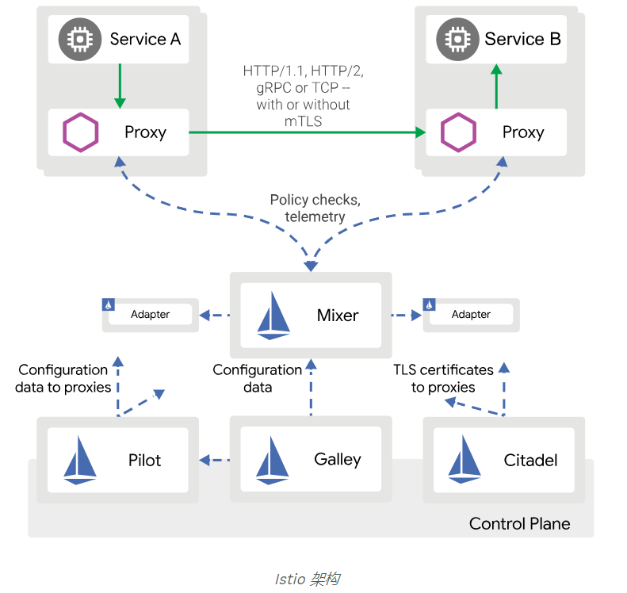

# Istio的架构

## 架构图
  

## 组件简要说明

- Pilot 负责在运行时配置Envoy和Mixer。

- Proxy / Envoy 每个微服务的Sidecar代理，用于处理集群中服务之间以及从服务到外部服务之间的入口/出口流量。 代理形成一个安全的微服务网格，提供丰富的功能，如发现，丰富的第7层路由，断路器，策略实施和遥测记录/报告功能。

- Mixer 在基础架构后端之上创建可移植层。 在基础架构级别实施ACL，速率限制，配额，身份验证，请求跟踪和遥测收集等策略。

- Citadel / Istio CA 通过TLS保护服务通信。 提供密钥管理系统，以自动化密钥和证书生成，分发，轮换和撤销。

- Ingress/Egress 为入站和出站外部流量配置基于路径的路由。

- Control Plane API ： 基础Orchestrator，如Kubernetes或Hashicorp Nomad。

# 安装
在k8s上的安装步骤

## 安装crd

## 安装镜像化的组件

## 安装相关服务

# 简单的bookinfo示例
