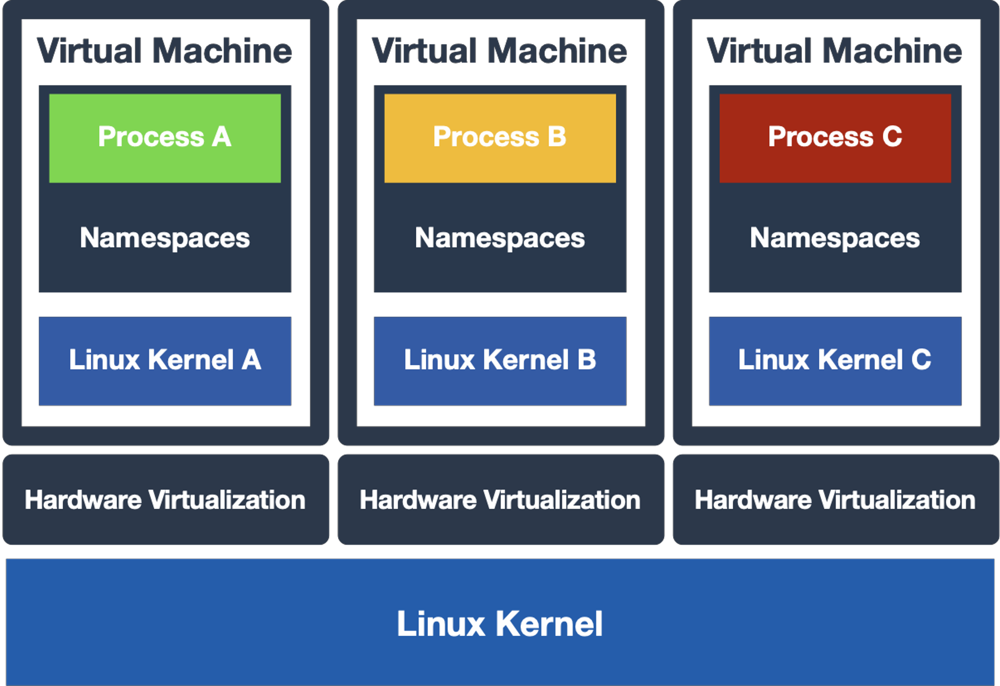
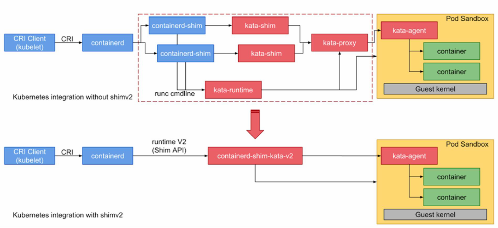
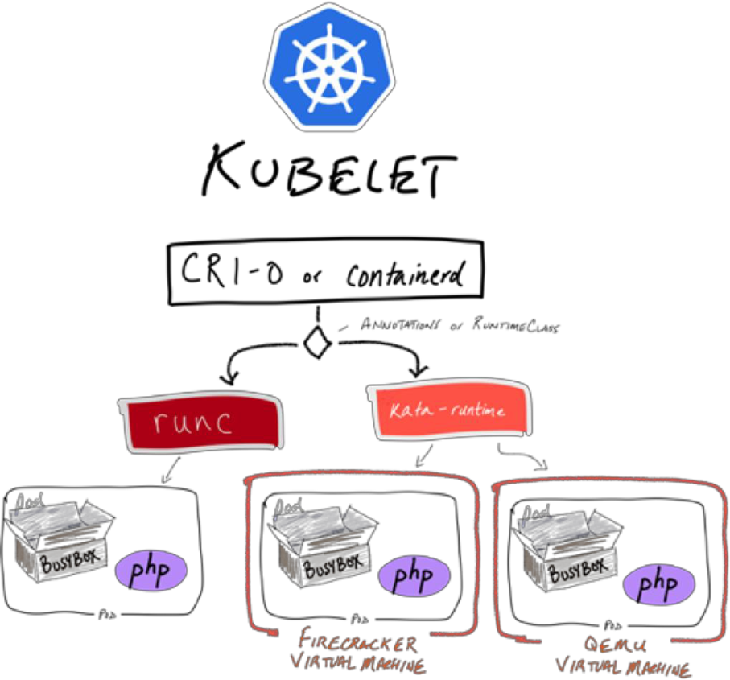

介绍使用katacontainer
<!--more-->

# Firecracker
- Virtual Machine Monitor
- Open source by AWS - Nov 2018
  - vmm with minimal design, thus less memory footprint and  attack surface
- Supported by Kata Containers since 1.5 release

# Kubernetes RuntimeClass
- Available since kubernetes v1.12 (beta feature since v1.14)
- Kubernetes native way to define multiple container runtimes
- Supported by CRI-O and containerd

# Contribute

- https://katacontainers.io
- code/docs: https://github.com/kata-containers/
- Apache 2.0 license
- Slack: bit.ly/KataSlack
