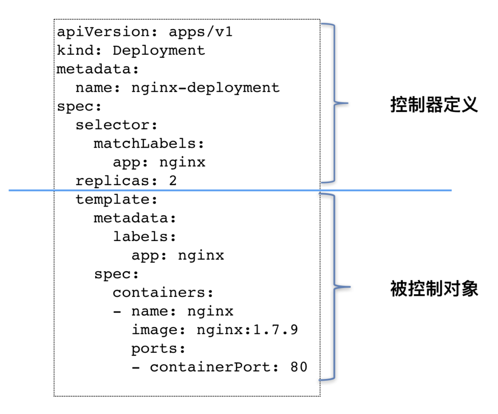
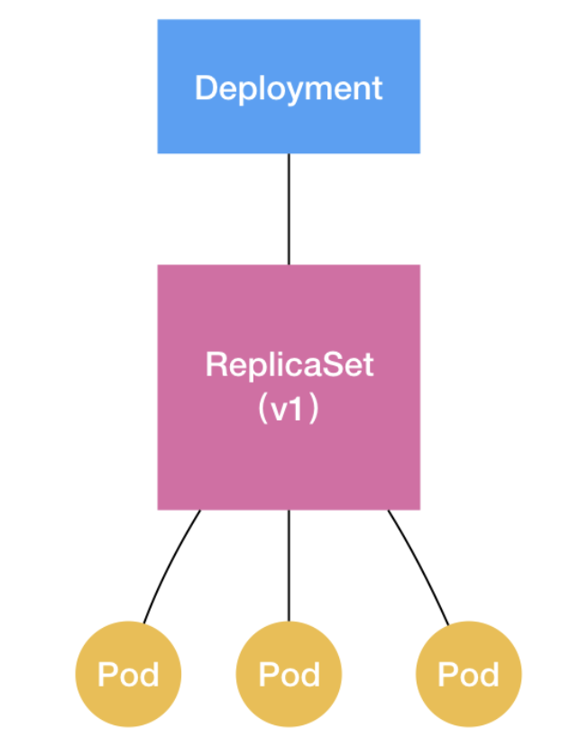

Pod 这个看似复杂的 API 对象，实际上就是对容器的进一步抽象和封装而已。

“容器”镜像虽然好用，但是容器这样一个“沙盒”的概念，对于描述应用来说，还是太过简单了。这就好比，集装箱固然好用，但是如果它四面都光秃秃的，吊车还怎么把这个集装箱吊起来并摆放好呢？

所以，Pod 对象，其实就是容器的升级版。它对容器进行了组合，添加了更多的属性和字段。这就好比给集装箱四面安装了吊环，使得 Kubernetes 这架“吊车”，可以更轻松地操作它。

而 Kubernetes 操作这些“集装箱”的逻辑，都由控制器（Controller）完成。

`kube-controller-manager` 这个组件，就是一系列控制器的集合。我们可以查看一下 Kubernetes 项目的 pkg/controller 目录：
```
cd kubernetes/pkg/controller/
$ ls -d */
deployment/             job/                    podautoscaler/
cloud/                  disruption/             namespace/
replicaset/             serviceaccount/         volume/
cronjob/                garbagecollector/       nodelifecycle/          replication/            statefulset/            daemon/
...
```

这个目录下面的每一个控制器，都以独有的方式负责某种编排功能。而我们的 Deployment，正是这些控制器中的一种。

实际上，这些控制器之所以被统一放在 pkg/controller 目录下，就是因为它们都遵循 Kubernetes 项目中的一个通用编排模式，即：控制循环（control loop）。

我们用一段伪代码来描述这个过程
```
for {
  实际状态 := 获取集群中对象 X 的实际状态（Actual State）
  期望状态 := 获取集群中对象 X 的期望状态（Desired State）
  if 实际状态 == 期望状态{
    什么都不做
  } else {
    执行编排动作，将实际状态调整为期望状态
  }
}
```


在具体实现中，实际状态往往来自于 Kubernetes 集群本身。

比如，kubelet 通过心跳汇报的容器状态和节点状态，或者监控系统中保存的应用监控数据，或者控制器主动收集的它自己感兴趣的信息，这些都是常见的实际状态的来源。

而期望状态，一般来自于用户提交的 YAML 文件。

比如，Deployment 对象中 Replicas 字段的值。很明显，这些信息往往都保存在 Etcd 中。

接下来，以 Deployment 为例，我和你简单描述一下它对控制器模型的实现：
Deployment 控制器从 Etcd 中获取到所有携带了“app: nginx”标签的 Pod，然后统计它们的数量，这就是实际状态；
Deployment 对象的 Replicas 字段的值就是期望状态；
Deployment 控制器将两个状态做比较，然后根据比较结果，确定是创建 Pod，还是删除已有的 Pod（具体如何操作 Pod 对象，我会在下一篇文章详细介绍）。
可以看到，一个 Kubernetes 对象的主要编排逻辑，实际上是在第三步的“对比”阶段完成的。

这个操作，通常被叫作调谐（Reconcile）。这个调谐的过程，则被称作“Reconcile Loop”（调谐循环）或者“Sync Loop”（同步循环）。

所以，如果你以后在文档或者社区中碰到这些词，都不要担心，它们其实指的都是同一个东西：控制循环。

而调谐的最终结果，往往都是对被控制对象的某种写操作。


对 Deployment 以及其他类似的控制器，做一个简单总结了：



如上图所示，类似 Deployment 这样的一个控制器，实际上都是由上半部分的控制器定义（包括期望状态），加上下半部分的被控制对象的模板组成的。


很多不同类型的容器编排功能，比如 StatefulSet、DaemonSet 等等，它们无一例外地都有这样一个甚至多个控制器的存在，并遵循控制循环（control loop）的流程，完成各自的编排逻辑。

实际上，跟 Deployment 相似，这些控制循环最后的执行结果，要么就是创建、更新一些 Pod（或者其他的 API 对象、资源），要么就是删除一些已经存在的 Pod（或者其他的 API 对象、资源）。

但也正是在这个统一的编排框架下，不同的控制器可以在具体执行过程中，设计不同的业务逻辑，从而达到不同的编排效果。

这个实现思路，正是 Kubernetes 项目进行容器编排的核心原理。


## deployment控制器
Deployment 看似简单，但实际上，它实现了 Kubernetes 项目中一个非常重要的功能：Pod 的“水平扩展 / 收缩”（horizontal scaling out/in）。这个功能，是从 PaaS 时代开始，一个平台级项目就必须具备的编排能力。

如果你更新了 Deployment 的 Pod 模板（比如，修改了容器的镜像），那么 Deployment 就需要遵循一种叫作“滚动更新”（rolling update）的方式，来升级现有的容器。

而这个能力的实现，依赖的是 Kubernetes 项目中的一个非常重要的概念（API 对象）：`ReplicaSet`。

```
apiVersion: apps/v1
kind: ReplicaSet
metadata:
  name: nginx-set
  labels:
    app: nginx
spec:
  replicas: 3
  selector:
    matchLabels:
      app: nginx
  template:
    metadata:
      labels:
        app: nginx
    spec:
      containers:
      - name: nginx
        image: nginx:1.7.9
```

从这个 YAML 文件中，我们可以看到，一个 ReplicaSet 对象，其实就是由副本数目的定义和一个 Pod 模板组成的。不难发现，它的定义其实是 Deployment 的一个子集。

更重要的是，`Deployment` 控制器实际操纵的，正是这样的 `ReplicaSet` 对象，而不是 Pod 对象。

```
apiVersion: apps/v1
kind: Deployment
metadata:
  name: nginx-deployment
  labels:
    app: nginx
spec:
  replicas: 3
  selector:
    matchLabels:
      app: nginx
  template:
    metadata:
      labels:
        app: nginx
    spec:
      containers:
      - name: nginx
        image: nginx:1.7.9
        ports:
        - containerPort: 80
```

可以看到，这就是一个我们常用的 nginx-deployment，它定义的 Pod 副本个数是 3（spec.replicas=3）。

那么，在具体的实现上，这个 Deployment，与 ReplicaSet，以及 Pod 的关系是怎样的呢？

从下图可以看出来：


通过这张图，可以很清楚的看到，一个定义了 replicas=3 的 Deployment，与它的 ReplicaSet，以及 Pod 的关系，实际上是一种“层层控制”的关系。

其中，ReplicaSet 负责通过“控制器模式”，保证系统中 Pod 的个数永远等于指定的个数（比如，3 个）。这也正是 Deployment 只允许容器的 restartPolicy=Always 的主要原因：只有在容器能保证自己始终是 Running 状态的前提下，ReplicaSet 调整 Pod 的个数才有意义。

而在此基础上，Deployment 同样通过“控制器模式”，来操作 ReplicaSet 的个数和属性，进而实现“水平扩展 / 收缩”和“滚动更新”这两个编排动作。

其中，“水平扩展 / 收缩”非常容易实现，Deployment Controller 只需要修改它所控制的 ReplicaSet 的 Pod 副本个数就可以了。
