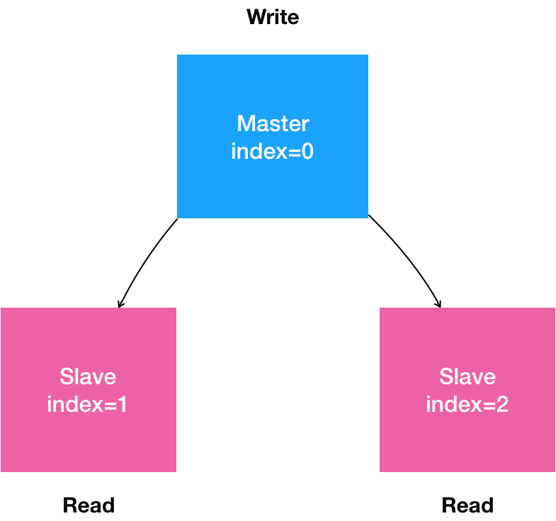
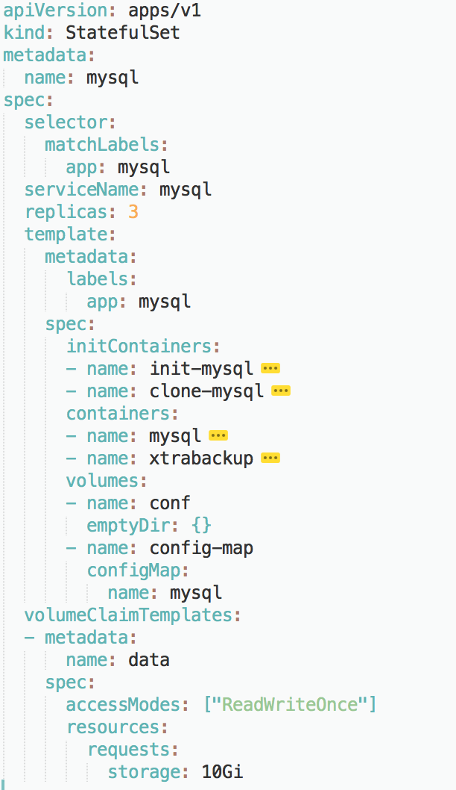

Deployment 实际上并不足以覆盖所有的应用编排问题。

造成这个问题的根本原因，在于 Deployment 对应用做了一个简单化假设。

它认为，一个应用的所有 Pod，是完全一样的。所以，它们互相之间没有顺序，也无所谓运行在哪台宿主机上。需要的时候，Deployment 就可以通过 Pod 模板创建新的 Pod；不需要的时候，Deployment 就可以“杀掉”任意一个 Pod。

但是，在实际的场景中，并不是所有的应用都可以满足这样的要求。

尤其是分布式应用，它的多个实例之间，往往有依赖关系，比如：主从关系、主备关系。


还有就是数据存储类应用，它的多个实例，往往都会在本地磁盘上保存一份数据。而这些实例一旦被杀掉，即便重建出来，实例与数据之间的对应关系也已经丢失，从而导致应用失败。

所以，这种实例之间有不对等关系，以及实例对外部数据有依赖关系的应用，就被称为“有状态应用”（Stateful Application）。

一旦你想要用容器运行“有状态应用”，其困难程度就会直线上升。而且，这个问题解决起来，单纯依靠容器技术本身已经无能为力，这也就导致了很长一段时间内，“有状态应用”几乎成了容器技术圈子的“忌讳”


不过，Kubernetes 项目还是成为了“第一个吃螃蟹的人”。

得益于“控制器模式”的设计思想，Kubernetes 项目很早就在 Deployment 的基础上，扩展出了对“有状态应用”的初步支持。这个编排功能，就是：StatefulSet。

StatefulSet 的设计其实非常容易理解。它把真实世界里的应用状态，抽象为了两种情况：
拓扑状态。这种情况意味着，应用的多个实例之间不是完全对等的关系。这些应用实例，必须按照某些顺序启动，比如应用的主节点 A 要先于从节点 B 启动。而如果你把 A 和 B 两个 Pod 删除掉，它们再次被创建出来时也必须严格按照这个顺序才行。并且，新创建出来的 Pod，必须和原来 Pod 的网络标识一样，这样原先的访问者才能使用同样的方法，访问到这个新 Pod。
存储状态。这种情况意味着，应用的多个实例分别绑定了不同的存储数据。对于这些应用实例来说，Pod A 第一次读取到的数据，和隔了十分钟之后再次读取到的数据，应该是同一份，哪怕在此期间 Pod A 被重新创建过。这种情况最典型的例子，就是一个数据库应用的多个存储实例。
所以，StatefulSet 的核心功能，就是通过某种方式记录这些状态，然后在 Pod 被重新创建时，能够为新 Pod 恢复这些状态。

# Headless Service

Service 是 Kubernetes 项目中用来将一组 Pod 暴露给外界访问的一种机制。比如，一个 Deployment 有 3 个 Pod，那么我就可以定义一个 Service。然后，用户只要能访问到这个 Service，它就能访问到某个具体的 Pod。

那么，这个 Service 又是如何被访问的呢？

第一种方式，是以 Service 的 VIP（Virtual IP，即：虚拟 IP）方式。比如：当我访问 10.0.23.1 这个 Service 的 IP 地址时，10.0.23.1 其实就是一个 VIP，它会把请求转发到该 Service 所代理的某一个 Pod 上。这里的具体原理，我会在后续的 Service 章节中进行详细介绍。

第二种方式，就是以 Service 的 DNS 方式。比如：这时候，只要我访问“my-svc.my-namespace.svc.cluster.local”这条 DNS 记录，就可以访问到名叫 my-svc 的 Service 所代理的某一个 Pod。

而在第二种 Service DNS 的方式下，具体还可以分为两种处理方法：

第一种处理方法，是 Normal Service。这种情况下，你访问“my-svc.my-namespace.svc.cluster.local”解析到的，正是 my-svc 这个 Service 的 VIP，后面的流程就跟 VIP 方式一致了。

而第二种处理方法，正是 Headless Service。这种情况下，你访问“my-svc.my-namespace.svc.cluster.local”解析到的，直接就是 my-svc 代理的某一个 Pod 的 IP 地址。可以看到，这里的区别在于，Headless Service 不需要分配一个 VIP，而是可以直接以 DNS 记录的方式解析出被代理 Pod 的 IP 地址。

下面是一个标准的 Headless Service 对应的 YAML 文件：
```
apiVersion: v1
kind: Service
metadata:
  name: nginx
  labels:
    app: nginx
spec:
  ports:
  - port: 80
    name: web
  clusterIP: None
  selector:
    app: nginx
```

可以看到，所谓的 Headless Service，其实仍是一个标准 Service 的 YAML 文件。只不过，它的 clusterIP 字段的值是：None，即：这个 Service，没有一个 VIP 作为“头”。这也就是 Headless 的含义。所以，这个 Service 被创建后并不会被分配一个 VIP，而是会以 DNS 记录的方式暴露出它所代理的 Pod。

而它所代理的 Pod，依然是采用 Label Selector 机制选择出来的，即：所有携带了 app=nginx 标签的 Pod，都会被这个 Service 代理起来。

当你按照这样的方式创建了一个 Headless Service 之后，它所代理的所有 Pod 的 IP 地址，都会被绑定一个这样格式的 DNS 记录，如下所示：
```
<pod-name>.<svc-name>.<namespace>.svc.cluster.local
```

这个 DNS 记录，正是 Kubernetes 项目为 Pod 分配的唯一的“可解析身份”（Resolvable Identity）。

有了这个“可解析身份”，只要你知道了一个 Pod 的名字，以及它对应的 Service 的名字，你就可以非常确定地通过这条 DNS 记录访问到 Pod 的 IP 地址。

## StatefulSet 又是如何使用这个 DNS 记录来维持 Pod 的拓扑状态的呢？

首先来看一个stateful的yaml文件
```
apiVersion: apps/v1
kind: StatefulSet
metadata:
  name: web
spec:
  serviceName: "nginx"
  replicas: 2
  selector:
    matchLabels:
      app: nginx
  template:
    metadata:
      labels:
        app: nginx
    spec:
      containers:
      - name: nginx
        image: nginx:1.9.1
        ports:
        - containerPort: 80
          name: web
```

这个 YAML 文件，和我们在前面文章中用到的 nginx-deployment 的唯一区别，就是多了一个 serviceName=nginx 字段。

这个字段的作用，就是告诉 StatefulSet 控制器，在执行控制循环（Control Loop）的时候，请使用 nginx 这个 Headless Service 来保证 Pod 的“可解析身份”。

根据yaml文件，我们创建svc和stateful
```
kubectl create -f svc.yaml
$ kubectl get service nginx
NAME      TYPE         CLUSTER-IP   EXTERNAL-IP   PORT(S)   AGE
nginx     ClusterIP    None         <none>        80/TCP    10s

$ kubectl create -f statefulset.yaml
$ kubectl get statefulset web
NAME      DESIRED   CURRENT   AGE
web       2         1         19s
```

可以通过这个 StatefulSet 的 Events 看到stateful的创建的信息
```
kubectl get pods -w -l app=nginx
NAME      READY     STATUS    RESTARTS   AGE
web-0     0/1       Pending   0          0s
web-0     0/1       Pending   0         0s
web-0     0/1       ContainerCreating   0         0s
web-0     1/1       Running   0         19s
web-1     0/1       Pending   0         0s
web-1     0/1       Pending   0         0s
web-1     0/1       ContainerCreating   0         0s
web-1     1/1       Running   0         20s
```

通过上面这个 Pod 的创建过程，我们不难看到，StatefulSet 给它所管理的所有 Pod 的名字，进行了编号，编号规则是：-。

而且这些编号都是从 0 开始累加，与 StatefulSet 的每个 Pod 实例一一对应，绝不重复。

更重要的是，这些 Pod 的创建，也是严格按照编号顺序进行的。比如，在 web-0 进入到 Running 状态、并且细分状态（Conditions）成为 Ready 之前，web-1 会一直处于 Pending 状态。

> 备注：Ready 状态再一次提醒了我们，为 Pod 设置 livenessProbe 和 readinessProbe 的重要性。

当这两个 Pod 都进入了 Running 状态之后，你就可以查看到它们各自唯一的“网络身份”了。

我们使用 kubectl exec 命令进入到容器中查看它们的 hostname：
```
kubectl exec web-0 -- sh -c 'hostname'
web-0
$ kubectl exec web-1 -- sh -c 'hostname'
web-1
```

可以看到，这两个 Pod 的 hostname 与 Pod 名字是一致的，都被分配了对应的编号。接下来，我们再试着以 DNS 的方式，访问一下这个 Headless Service：
```
kubectl run -i --tty --image busybox dns-test --restart=Never --rm /bin/sh
```


通过这条命令，我们启动了一个一次性的 Pod，因为–rm 意味着 Pod 退出后就会被删除掉。然后，在这个 Pod 的容器里面，我们尝试用 nslookup 命令，解析一下 Pod 对应的 Headless Service：
```
kubectl run -i --tty --image busybox dns-test --restart=Never --rm /bin/sh
$ nslookup web-0.nginx
Server:    10.0.0.10
Address 1: 10.0.0.10 kube-dns.kube-system.svc.cluster.local

Name:      web-0.nginx
Address 1: 10.244.1.7

$ nslookup web-1.nginx
Server:    10.0.0.10
Address 1: 10.0.0.10 kube-dns.kube-system.svc.cluster.local

Name:      web-1.nginx
Address 1: 10.244.2.7
```

从 nslookup 命令的输出结果中，我们可以看到，在访问 web-0.nginx 的时候，最后解析到的，正是 web-0 这个 Pod 的 IP 地址；而当访问 web-1.nginx 的时候，解析到的则是 web-1 的 IP 地址。

这时候，如果你在另外一个 Terminal 里把这两个“有状态应用”的 Pod 删掉：
```
kubectl delete pod -l app=nginx
pod "web-0" deleted
pod "web-1" deleted
```

然后，再在当前 Terminal 里 Watch 一下这两个 Pod 的状态变化，就会发现一个有趣的现象：
```
kubectl get pod -w -l app=nginx
NAME      READY     STATUS              RESTARTS   AGE
web-0     0/1       ContainerCreating   0          0s
NAME      READY     STATUS    RESTARTS   AGE
web-0     1/1       Running   0          2s
web-1     0/1       Pending   0         0s
web-1     0/1       ContainerCreating   0         0s
web-1     1/1       Running   0         32s
```

可以看到，当我们把这两个 Pod 删除之后，Kubernetes 会按照原先编号的顺序，创建出了两个新的 Pod。并且，Kubernetes 依然为它们分配了与原来相同的“网络身份”：web-0.nginx 和 web-1.nginx。

通过这种严格的对应规则，StatefulSet 就保证了 Pod 网络标识的稳定性。

比如，如果 web-0 是一个需要先启动的主节点，web-1 是一个后启动的从节点，那么只要这个 StatefulSet 不被删除，你访问 web-0.nginx 时始终都会落在主节点上，访问 web-1.nginx 时，则始终都会落在从节点上，这个关系绝对不会发生任何变化。

所以，如果我们再用 nslookup 命令，查看一下这个新 Pod 对应的 Headless Service 的话：

```
kubectl run -i --tty --image busybox dns-test --restart=Never --rm /bin/sh
$ nslookup web-0.nginx
Server:    10.0.0.10
Address 1: 10.0.0.10 kube-dns.kube-system.svc.cluster.local

Name:      web-0.nginx
Address 1: 10.244.1.8

$ nslookup web-1.nginx
Server:    10.0.0.10
Address 1: 10.0.0.10 kube-dns.kube-system.svc.cluster.local

Name:      web-1.nginx
Address 1: 10.244.2.8
```

我们可以看到，在这个 StatefulSet 中，这两个新 Pod 的“网络标识”（比如：web-0.nginx 和 web-1.nginx），再次解析到了正确的 IP 地址（比如：web-0 Pod 的 IP 地址 10.244.1.8）。

通过这种方法，Kubernetes 就成功地将 Pod 的拓扑状态（比如：哪个节点先启动，哪个节点后启动），按照 Pod 的“名字 + 编号”的方式固定了下来。此外，Kubernetes 还为每一个 Pod 提供了一个固定并且唯一的访问入口，即：这个 Pod 对应的 DNS 记录。

这些状态，在 StatefulSet 的整个生命周期里都会保持不变，绝不会因为对应 Pod 的删除或者重新创建而失效。

不过，相信你也已经注意到了，尽管 web-0.nginx 这条记录本身不会变，但它解析到的 Pod 的 IP 地址，并不是固定的。这就意味着，对于“有状态应用”实例的访问，你必须使用 DNS 记录或者 hostname 的方式，而绝不应该直接访问这些 Pod 的 IP 地址。


StatefulSet 如何保证应用实例之间“拓扑状态”的稳定性。

如果用一句话来总结的话，你可以这么理解这个过程：

> StatefulSet 这个控制器的主要作用之一，就是使用 Pod 模板创建 Pod 的时候，对它们进行编号，并且按照编号顺序逐一完成创建工作。而当 StatefulSet 的“控制循环”发现 Pod 的“实际状态”与“期望状态”不一致，需要新建或者删除 Pod 进行“调谐”的时候，它会严格按照这些 Pod 编号的顺序，逐一完成这些操作。

所以，StatefulSet 其实可以认为是对 Deployment 的改良。

与此同时，通过 Headless Service 的方式，StatefulSet 为每个 Pod 创建了一个固定并且稳定的 DNS 记录，来作为它的访问入口。

实际上，在部署“有状态应用”的时候，应用的每个实例拥有唯一并且稳定的“网络标识”，是一个非常重要的假设。


====================
# StatefulSet 示例

首先，用自然语言来描述一下我们想要部署的“有状态应用”。
1. 是一个“主从复制”（Maser-Slave Replication）的 MySQL 集群；
2. 有 1 个主节点（Master）；
3. 有多个从节点（Slave）；
4. 从节点需要能水平扩展；
5. 所有的写操作，只能在主节点上执行；
6. 读操作可以在所有节点上执行。



## 在常规下,我们配置mysql-master-slave的步骤:

### 第一步:通过 `XtraBackup` 将 `Master` 节点的数据备份到指定目录。
这一步会自动在目标目录里生成一个备份信息文件，名叫：xtrabackup_binlog_info。这个文件一般会包含如下两个信息：
```
cat xtrabackup_binlog_info
TheMaster-bin.000001     481
```
这两个信息会在接下来配置 Slave 节点的时候用到。

### 第二步：配置 Slave 节点。
Slave 节点在第一次启动前，需要先把 Master 节点的备份数据，连同备份信息文件，一起拷贝到自己的数据目录（/var/lib/mysql）下。然后，我们执行这样一句 SQL：
```
CHANGE MASTER TO
MASTER_HOST='$masterip',
MASTER_USER='xxx',
MASTER_PASSWORD='xxx',
MASTER_LOG_FILE='TheMaster-bin.000001',
MASTER_LOG_POS=481;
```

其中，MASTER_LOG_FILE 和 MASTER_LOG_POS，就是该备份对应的二进制日志（Binary Log）文件的名称和开始的位置（偏移量），也正是 xtrabackup_binlog_info 文件里的那两部分内容（即：TheMaster-bin.000001 和 481）。

### 第三步:启动 Slave 节点
在这一步，我们需要执行这样一句 SQL：
```
START SLAVE;
```
这样，Slave 节点就启动了。它会使用备份信息文件中的二进制日志文件和偏移量，与主节点进行数据同步。

### 第四步:在这个集群中添加更多的 Slave 节点
需要注意的是，新添加的 Slave 节点的备份数据，来自于已经存在的 Slave 节点。

所以，在这一步，我们需要将 Slave 节点的数据备份在指定目录。而这个备份操作会自动生成另一种备份信息文件，名叫：xtrabackup_slave_info。同样地，这个文件也包含了 MASTER_LOG_FILE 和 MASTER_LOG_POS 两个字段。

然后，我们就可以执行跟前面一样的“CHANGE MASTER TO”和“START SLAVE” 指令，来初始化并启动这个新的 Slave 节点了。

## 使用k8s部署需要解决的问题
通过上面的叙述，我们不难看到，将部署 MySQL 集群的流程迁移到 Kubernetes 项目上，需要能够“容器化”地解决下面的“三座大山”：

1. Master 节点和 Slave 节点需要有不同的配置文件（即：不同的 my.cnf）；
2. Master 节点和 Slave 节点需要能够传输备份信息文件；
3. 在 Slave 节点第一次启动之前，需要执行一些初始化 SQL 操作；


而由于 MySQL 本身同时拥有拓扑状态（主从节点的区别）和存储状态（MySQL 保存在本地的数据），我们要通过 StatefulSet 来解决这“三座大山”的问题。

### 第一座大山：Master 节点和 Slave 节点需要有不同的配置文件
我们只需要给主从节点分别准备两份不同的 MySQL 配置文件，然后根据 Pod 的序号（Index）挂载进去即可。
```
apiVersion: v1
kind: ConfigMap
metadata:
  name: mysql
  labels:
    app: mysql
data:
  master.cnf: |
    # 主节点 MySQL 的配置文件
    [mysqld]
    log-bin
  slave.cnf: |
    # 从节点 MySQL 的配置文件
    [mysqld]
    super-read-only
```

在这里，我们定义了 master.cnf 和 slave.cnf 两个 MySQL 的配置文件。
- master.cnf 开启了 log-bin，即：使用二进制日志文件的方式进行主从复制，这是一个标准的设置。
- slave.cnf 的开启了 super-read-only，代表的是从节点会拒绝除了主节点的数据同步操作之外的所有写操作，即：它对用户是只读的。


而上述 ConfigMap 定义里的 data 部分，是 Key-Value 格式的。比如，master.cnf 就是这份配置数据的 Key，而“|”后面的内容，就是这份配置数据的 Value。这份数据将来挂载进 Master 节点对应的 Pod 后，就会在 Volume 目录里生成一个叫作 master.cnf 的文件。

接下来，我们需要创建两个 Service 来供 StatefulSet 以及用户使用。这两个 Service 的定义如下所示：
```
apiVersion: v1
kind: Service
metadata:
  name: mysql
  labels:
    app: mysql
spec:
  ports:
  - name: mysql
    port: 3306
  clusterIP: None
  selector:
    app: mysql
---
apiVersion: v1
kind: Service
metadata:
  name: mysql-read
  labels:
    app: mysql
spec:
  ports:
  - name: mysql
    port: 3306
  selector:
    app: mysql
```

可以看到，这两个 Service 都代理了所有携带 app=mysql 标签的 Pod，也就是所有的 MySQL Pod。端口映射都是用 Service 的 3306 端口对应 Pod 的 3306 端口。

不同的是:

- 第一个名叫“mysql”的 Service 是一个 Headless Service（即：clusterIP= None）。所以它的作用，是通过为 Pod 分配 DNS 记录来固定它的拓扑状态，比如“mysql-0.mysql”和“mysql-1.mysql”这样的 DNS 名字。其中，编号为 0 的节点就是我们的主节点。

- 而第二个名叫“mysql-read”的 Service，则是一个常规的 Service。

并且我们可以规定，所有用户的**读请求**，都必须访问**第二个 Service **被自动分配的 DNS 记录，即：“mysql-read”（当然，也可以访问这个 Service 的 VIP）。这样，读请求就可以被转发到任意一个 MySQL 的主节点或者从节点上。

而所有用户的写请求，则必须直接以 DNS 记录的方式访问到 MySQL 的主节点，也就是：“mysql-0.mysql“这条 DNS 记录。

### 第二座大山:Master 节点和 Slave 节点需要能够传输备份文件”的问题

翻越这座大山的思路，比较推荐的做法是：先搭建框架，再完善细节。其中，Pod 部分如何定义，是完善细节时的重点。

先为 StatefulSet 对象规划一个大致的框架



比如：selector 表示，这个 StatefulSet 要管理的 Pod 必须携带 app=mysql 标签；它声明要使用的 Headless Service 的名字是：mysql。

这个 StatefulSet 的 replicas 值是 3，表示它定义的 MySQL 集群有三个节点：一个 Master 节点，两个 Slave 节点。

可以看到，StatefulSet 管理的“有状态应用”的多个实例，也都是通过同一份 Pod 模板创建出来的，使用的是同一个 Docker 镜像。

除了这些基本的字段外，作为一个有存储状态的 MySQL 集群，StatefulSet 还需要管理存储状态。所以，我们需要通过 volumeClaimTemplate（PVC 模板）来为每个 Pod 定义 PVC。比如，这个 PVC 模板的 resources.requests.strorage 指定了存储的大小为 10 GiB；ReadWriteOnce 指定了该存储的属性为可读写，并且一个 PV 只允许挂载在一个宿主机上。将来，这个 PV 对应的的 Volume 就会充当 MySQL Pod 的存储数据目录。

然后，重点设计一下这个 StatefulSet 的 Pod 模板，也就是 template 字段。

由于 StatefulSet 管理的 Pod 都来自于同一个镜像，这就要求我们在编写 Pod 时，一定要保持清醒，用“人格分裂”的方式进行思考：
- 如果这个 Pod 是 Master 节点，我们要怎么做；
- 如果这个 Pod 是 Slave 节点，我们又要怎么做。

#### 第一步：从 ConfigMap 中，获取 MySQL 的 Pod 对应的配置文件。

为此，我们需要进行一个初始化操作，根据节点的角色是 Master 还是 Slave 节点，为 Pod 分配对应的配置文件。此外，MySQL 还要求集群里的每个节点都有一个唯一的 ID 文件，名叫 server-id.cnf。

而根据我们已经掌握的 Pod 知识，这些初始化操作显然适合通过 InitContainer 来完成。所以，我们首先定义了一个 InitContainer，如下所示：

```
...
# template.spec
initContainers:
- name: init-mysql
  image: mysql:5.7
  command:
  - bash
  - "-c"
  - |
    set -ex
    # 从 Pod 的序号，生成 server-id
    [[ `hostname` =~ -([0-9]+)$ ]] || exit 1
    ordinal=${BASH_REMATCH[1]}
    echo [mysqld] > /mnt/conf.d/server-id.cnf
    # 由于 server-id=0 有特殊含义，我们给 ID 加一个 100 来避开它
    echo server-id=$((100 + $ordinal)) >> /mnt/conf.d/server-id.cnf
    # 如果 Pod 序号是 0，说明它是 Master 节点，从 ConfigMap 里把 Master 的配置文件拷贝到 /mnt/conf.d/ 目录；
    # 否则，拷贝 Slave 的配置文件
    if [[ $ordinal -eq 0 ]]; then
      cp /mnt/config-map/master.cnf /mnt/conf.d/
    else
      cp /mnt/config-map/slave.cnf /mnt/conf.d/
    fi
  volumeMounts:
  - name: conf
    mountPath: /mnt/conf.d
  - name: config-map
    mountPath: /mnt/config-map
```

在这个名叫 init-mysql 的 InitContainer 的配置中，它从 Pod 的 hostname 里，读取到了 Pod 的序号，以此作为 MySQL 节点的 server-id。

然后，init-mysql 通过这个序号，判断当前 Pod 到底是 Master 节点（即：序号为 0）还是 Slave 节点（即：序号不为 0），从而把对应的配置文件从 /mnt/config-map 目录拷贝到 /mnt/conf.d/ 目录下。

其中，文件拷贝的源目录 /mnt/config-map，正是 ConfigMap 在这个 Pod 的 Volume，如下所示：
```
      ...
      # template.spec
      volumes:
      - name: conf
        emptyDir: {}
      - name: config-map
        configMap:
          name: mysql
```

通过这个定义，init-mysql 在声明了挂载 config-map 这个 Volume 之后，ConfigMap 里保存的内容，就会以文件的方式出现在它的 /mnt/config-map 目录当中。

而文件拷贝的目标目录，即容器里的 /mnt/conf.d/ 目录，对应的则是一个名叫 conf 的、emptyDir 类型的 Volume。基于 Pod Volume 共享的原理，当 InitContainer 复制完配置文件退出后，后面启动的 MySQL 容器只需要直接声明挂载这个名叫 conf 的 Volume，它所需要的.cnf 配置文件已经出现在里面了。这跟我们之前介绍的 Tomcat 和 WAR 包的处理方法是完全一样的。


#### 第二步：在 Slave Pod 启动前，从 Master 或者其他 Slave Pod 里拷贝数据库数据到自己的目录下。

为了实现这个操作，我们就需要再定义第二个 InitContainer，如下所示：
```
      ...
      # template.spec.initContainers
      - name: clone-mysql
        image: gcr.io/google-samples/xtrabackup:1.0
        command:
        - bash
        - "-c"
        - |
          set -ex
          # 拷贝操作只需要在第一次启动时进行，所以如果数据已经存在，跳过
          [[ -d /var/lib/mysql/mysql ]] && exit 0
          # Master 节点 (序号为 0) 不需要做这个操作
          [[ `hostname` =~ -([0-9]+)$ ]] || exit 1
          ordinal=${BASH_REMATCH[1]}
          [[ $ordinal -eq 0 ]] && exit 0
          # 使用 ncat 指令，远程地从前一个节点拷贝数据到本地
          ncat --recv-only mysql-$(($ordinal-1)).mysql 3307 | xbstream -x -C /var/lib/mysql
          # 执行 --prepare，这样拷贝来的数据就可以用作恢复了
          xtrabackup --prepare --target-dir=/var/lib/mysql
        volumeMounts:
        - name: data
          mountPath: /var/lib/mysql
          subPath: mysql
        - name: conf
          mountPath: /etc/mysql/conf.d
```

在这个名叫 clone-mysql 的 InitContainer 里，我们使用的是 xtrabackup 镜像（它里面安装了 xtrabackup 工具）。

而在它的启动命令里，我们首先做了一个判断。即：当初始化所需的数据（/var/lib/mysql/mysql 目录）已经存在，或者当前 Pod 是 Master 节点的时候，不需要做拷贝操作。

接下来，clone-mysql 会使用 Linux 自带的 ncat 指令，向 DNS 记录为“mysql-< 当前序号减一 >.mysql”的 Pod，也就是当前 Pod 的前一个 Pod，发起数据传输请求，并且直接用 xbstream 指令将收到的备份数据保存在 /var/lib/mysql 目录下。

> 备注：3307 是一个特殊端口，运行着一个专门负责备份 MySQL 数据的辅助进程。我们后面马上会讲到它。

当然，这一步你可以随意选择用自己喜欢的方法来传输数据。比如，用 scp 或者 rsync，都没问题。

你可能已经注意到，这个容器里的 /var/lib/mysql 目录，实际上正是一个名为 data 的 PVC，即：我们在前面声明的持久化存储。
