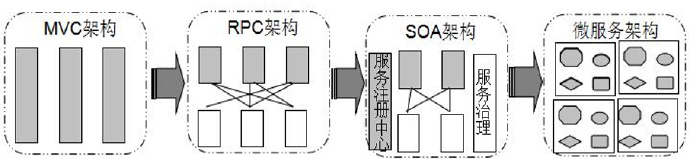
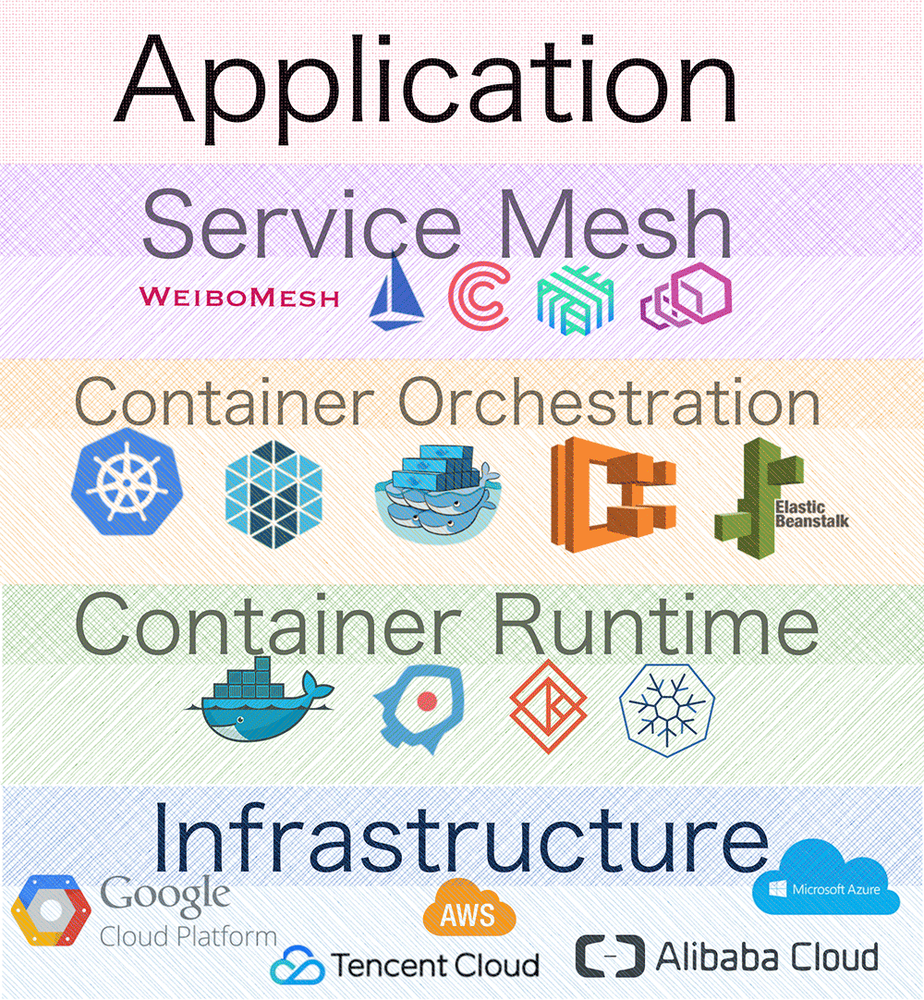

what is service mesh

Service Mesh 这个概念的定义则是 Buoyant, Inc 公司的 CEO William Morgan 于 2017 年 4 月 25 日在公司官网发布的题为 **"What’s a service mesh? And why do I need one?" **的文章中给出的。下面我们来看一下定义的内容：

> WHAT IS A SERVICE MESH?
A service mesh is a dedicated infrastructure layer for handling service-to-service communication. It’s responsible for the reliable delivery of requests through the complex topology of services that comprise a modern, cloud native application. In practice, the service mesh is typically implemented as an array of lightweight network proxies that are deployed alongside application code, without the application needing to be aware. (But there are variations to this idea, as we’ll see.)

原文翻译：
Service Mesh 是一个基础设施层，用于处理服务间通信。
云原生应用有着复杂的服务拓扑，Service Mesh 保证请求可以在这些拓扑中可靠地穿梭。
在实际应用当中，Service Mesh 通常是由一系列轻量级的网络代理组成的，它们与应用程序部署在一起，但应用程序不需要知道它们的存在。

关于这个定义有以下两个值得我们关注的核心点：
- Service Mesh 是一个专门负责请求可靠传输的基础设施层；
- Service Mesh 的实现为一组同应用部署在一起并且对应用透明的轻量网络代理。

文中 William Morgan 对 Service Mesh 概念的补充说明也进一步明确了 Service Mesh 的职责边界。我们来看看这段说明原文：

> The concept of the service mesh as a separate layer is tied to the rise of the cloud native application. In the cloud native model, a single application might consist of hundreds of services; each service might have thousands of instances; and each of those instances might be in a constantly-changing state as they are dynamically scheduled by an orchestrator like Kubernetes. Not only is service communication in this world incredibly complex, it’s a pervasive and fundamental part of runtime behavior. Managing it is vital to ensuring end-to-end performance and reliability.

原文翻译：
随着云原生应用的崛起，Service Mesh 逐渐成为一个独立的基础设施层。
在云原生模型里，一个应用可以由数百个服务组成，每个服务可能有数千个实例，而每个实例可能会持续地发生变化。
服务间通信不仅异常复杂，而且也是运行时行为的基础。
管理好服务间通信对于保证端到端的性能和可靠性来说是非常重要的。

结合前面的定义，用一句话总结：服务治理和请求可靠传输就是 Service Mesh 这个基础设施层的职能边界。

## 架构演进的常见历程

为了保证项目能快速成型并上线，起初的应用可能是一个大一统的单体服务，所有业务逻辑、数据层依赖等都在一个项目中完成，这么做的好处在于：开发独立、快速，利用资源合理，服务调用更直接、性能更高等等。

但缺点也不少，最致命的问题就是耦合，而且随着业务的不断堆叠这种耦合会越来越严重，项目越来越臃肿。

所以下一步通常都会往模块化的服务演进，比如 MVC 模式的使用、RPC 技术的引入等，主要解决业务或者功能模块之间耦合的问题。

随着业务量的增长和组织的扩大，性能和扩展性将是不得不面对的大问题，所以通常会按照 SOA 的思路进行面向服务的体系结构拆分。

随着云化技术的发展，容器技术的普及，考虑到集群的弹性运维以及业务运营维护成本、业务运营演进效率等问题，微服务架构就显得更贴近现实。

=========================
微服务对比之前的各种传统架构模式带来了一沓子的好处，比如降低了单体服务的复杂性，随即提升了开发速度，而且代码更容易理解和维护，开发团队对技术的选择变得更自由，每个微服务都独立部署所以能很方便调配部署的方式及规模等等。

与传统基于 DNS 和中心化的 Server 端负载均衡来实现服务依赖和治理的形式相比，基于注册中心和一个去中心化的 Client 端负载均衡来实现服务注册发现和治理的微服务则是更加复杂的分布式应用，不管是部署形式还是服务的发现、服务依赖调用和请求传输等问题都变得非常难以处理。因为整个体系有太多的不稳定因素，比如网络的分区可能导致服务得不到有效治理。

这里的重点就是要面对微服务架构下服务的治理与请求的可靠传输等问题，这就是为什么需要有 Service Mesh 这样的一个基础设施层来对应用透明化地解决这些问题。

