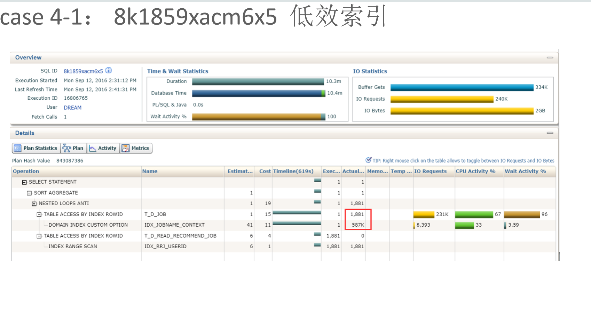
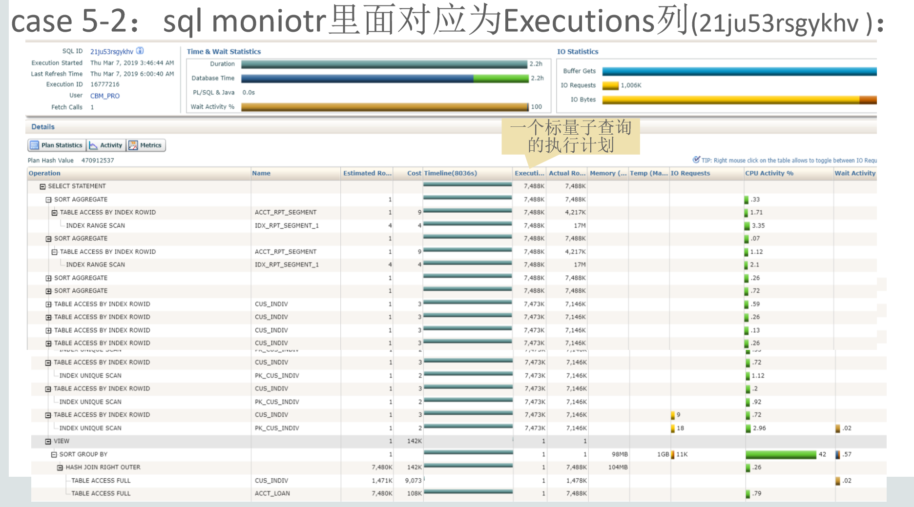
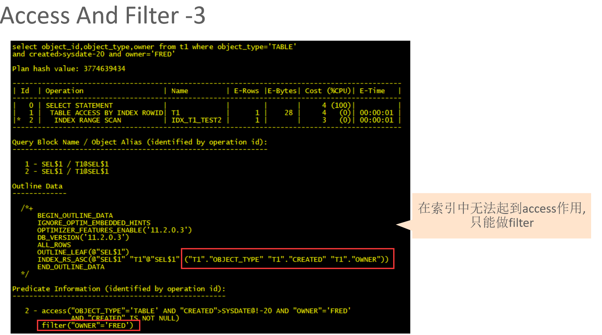

直方图

ndv = 2  100w的记录

软软解析生效需要代码部分加声明

AWR默认保留8天，间隔1小时
AWR保留建议：一个月
默认

想保留久一点儿的，不需要保留太长时间，直接做基线，每个月做一个基线

并发：很多session
并行：1个session

返回一条记录，几个buffer正常

open_cursor 针对的是单个session

sequence order=n cache=1000

正常的硬解析每秒10以下

index contention 是高并发
row lock contention 是dml的问题

gather_plan_statistics使用
http://blog.itpub.net/7569309/viewspace-2134168/

BIND_AWARE
http://blog.itpub.net/28539951/viewspace-2132051/

sql_monitor

备份策略优化 block_trace

sqlt /util /coe_load_sql

xfr  是用来做系统间的执行计划的迁移的，所以其实不用，太麻烦了，用coe_load_sql就可以了

coe_profile.sql 用来代替 coe_load_sql_profile.sql

signature

查看统计计划的变化以及有多少统计计划
ora pc

hashjoin
build表一定会扫描完的

3 100   30

100 3  1

直方图只有在使用过的谓词字段，才会收集
可以用explain去收集

ACS? bind_warea

==========
filter有两个或以上的子操作，往往效率比较低

cluseter factor

58W的，需要23W次的io

======================

标量子查询是必须要改写的

index fast full scan 是不回表的

=====================

在索引中无法起到access作用, 只能做filter
所以需要把非等值的字段，放在组合索引的最后

======================
看索引的结构 treedump

什么时候用索引: 5% ?

null值不保存在索引
