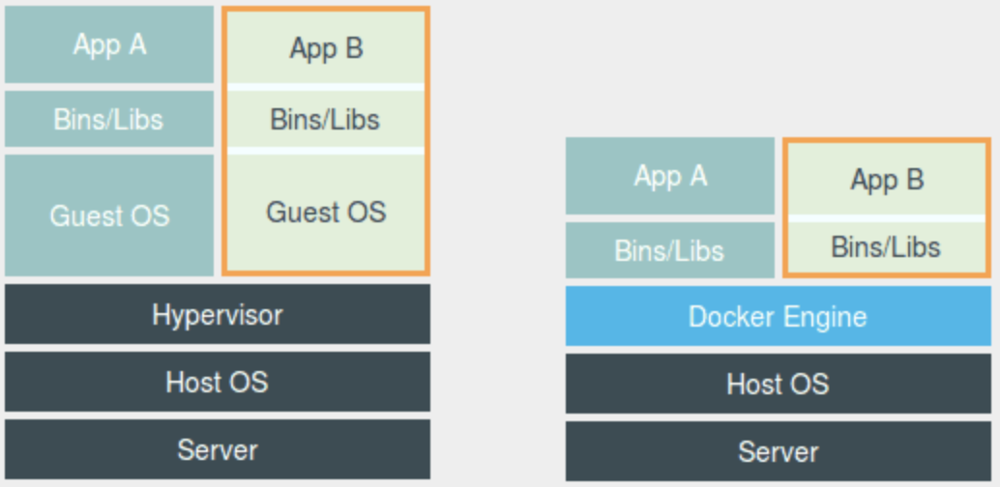
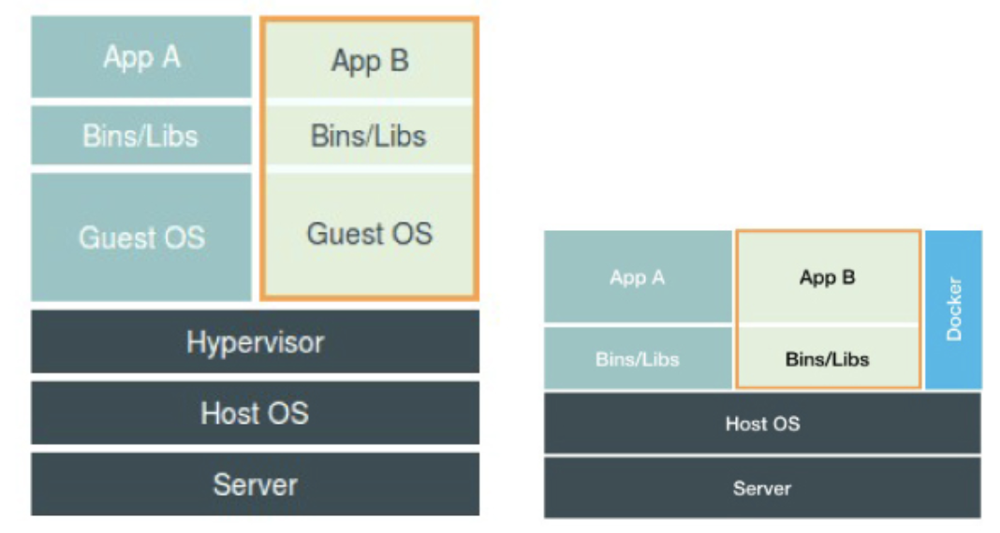

深入解析下docker的 `隔离`与`限制`

<!--more-->

# 容器对隔离与限制
## 容器的namespace

```
# docker run -it busybox /bin/sh
Unable to find image 'busybox:latest' locally
latest: Pulling from library/busybox
ee153a04d683: Pull complete
Digest: sha256:9f1003c480699be56815db0f8146ad2e22efea85129b5b5983d0e0fb52d9ab70
Status: Downloaded newer image for busybox:latest
/ # ps
PID   USER     TIME  COMMAND
    1 root      0:00 /bin/sh
    6 root      0:00 ps
/ #
```

在 Docker 里最开始执行的 /bin/sh，就是这个容器内部的第 1 号进程（PID=1），而这个容器里一共只有两个进程在运行。这就意味着，前面执行的 /bin/sh，以及我们刚刚执行的 ps，已经被 Docker 隔离在了一个跟宿主机完全不同的世界当中。

这究竟是怎么做到呢？

本来，每当我们在宿主机上运行了一个 /bin/sh 程序，操作系统都会给它分配一个进程编号，比如 PID=100。这个编号是进程的唯一标识，就像员工的工牌一样。所以 PID=100，可以粗略地理解为这个 `/bin/sh` 是我们公司里的第 100 号员工，而第 1 号员工就自然是董事长这样统领全局的人物

而现在，我们要通过 Docker 把这个 /bin/sh 程序运行在一个容器当中。这时候，Docker 就会在这个第 100 号员工入职时给它施一个“障眼法”，让他永远看不到前面的其他 99 个员工，更看不到董事长。这样，它就会错误地以为自己就是公司里的第 1 号员工。

这种机制，其实就是对被隔离应用的进程空间做了手脚，使得这些进程只能看到重新计算过的进程编号，比如 PID=1。可实际上，他们在宿主机的操作系统里，还是原来的第 100 号进程。


这种技术，就是 Linux 里面的 Namespace 机制。而 Namespace 的使用方式也非常有意思：它其实只是 Linux 创建新进程的一个可选参数。我们知道，在 Linux 系统中创建线程的系统调用是 clone()，比如

```
int pid = clone(main_function, stack_size, SIGCHLD, NULL); 
```

这个系统调用就会为我们创建一个新的进程，并且返回它的进程号 pid。

而当我们用 clone() 系统调用创建一个新进程时，就可以在参数中指定 CLONE_NEWPID 参数，比如：

```
int pid = clone(main_function, stack_size, CLONE_NEWPID | SIGCHLD, NULL);
```

这时，新创建的这个进程将会“看到”一个全新的进程空间，在这个进程空间里，它的 PID 是 1。之所以说“看到”，是因为这只是一个“障眼法”，在宿主机真实的进程空间里，这个进程的 PID 还是真实的数值，比如 100。

当然，我们还可以多次执行上面的 clone() 调用，这样就会创建多个 PID Namespace，而每个 Namespace 里的应用进程，都会认为自己是当前容器里的第 1 号进程，它们既看不到宿主机里真正的进程空间，也看不到其他 PID Namespace 里的具体情况。

而除了我们刚刚用到的 PID Namespace，Linux 操作系统还提供了 Mount、UTS、IPC、Network 和 User 这些 Namespace，用来对各种不同的进程上下文进行“障眼法”操作。

比如:
`Mount Namespace`，用于让被隔离进程只看到当前 Namespace 里的挂载点信息；
`Network Namespace`，用于让被隔离进程看到当前 Namespace 里的网络设备和配置。

这就是 Linux 容器最基本的实现原理了。




这幅图的左边，画出了虚拟机的工作原理。其中，名为 `Hypervisor` 的软件是虚拟机最主要的部分。它通过硬件虚拟化功能，模拟出了运行一个操作系统需要的各种硬件，比如 CPU、内存、I/O 设备等等。然后，它在这些虚拟的硬件上安装了一个新的操作系统，即 `Guest OS`。
这样，用户的应用进程就可以运行在这个虚拟的机器中，它能看到的自然也只有 Guest OS 的文件和目录，以及这个机器里的虚拟设备。这就是为什么虚拟机也能起到将不同的应用进程相互隔离的作用。

而这幅图的右边，则用一个名为 `Docker Engine` 的软件替换了 `Hypervisor`。这也是为什么，很多人会把 Docker 项目称为“轻量级”虚拟化技术的原因，实际上就是把虚拟机的概念套在了容器上。

可是这样的说法，却并不严谨。

在理解了 Namespace 的工作方式之后，我们就会明白，跟真实存在的虚拟机不同，在使用 Docker 的时候，并没有一个真正的“Docker 容器”运行在宿主机里面。Docker 项目帮助用户启动的，还是原来的应用进程，只不过在创建这些进程时，Docker 为它们加上了各种各样的 Namespace 参数。

这时，这些进程就会觉得自己是各自 `PID Namespace` 里的第 1 号进程，只能看到各自 `Mount Namespace` 里挂载的目录和文件，只能访问到各自 `Network Namespace` 里的网络设备，就仿佛运行在一个个“容器”里面，与世隔绝。



在之前虚拟机与容器技术的对比图里，不应该把 `Docker Engine` 或者任何容器管理工具放在跟 `Hypervisor` 相同的位置，因为它们并不像 `Hypervisor` 那样对应用进程的隔离环境负责，也不会创建任何实体的“容器”，真正对隔离环境负责的是宿主机操作系统本身

所以，在这个对比图里，我们应该把 `Docker` 画在跟应用同级别并且靠边的位置。这意味着，用户运行在容器里的应用进程，跟宿主机上的其他进程一样，都由宿主机操作系统统一管理，只不过这些被隔离的进程拥有额外设置过的 `Namespace` 参数。而 `Docker` 项目在这里扮演的角色，更多的是旁路式的辅助和管理工作。


这样的架构也解释了为什么 Docker 项目比虚拟机更受欢迎的原因。

这是因为，使用虚拟化技术作为应用沙盒，就必须要由 `Hypervisor` 来负责创建虚拟机，这个虚拟机是真实存在的，并且它里面必须运行一个完整的 `Guest OS` 才能执行用户的应用进程。这就不可避免地带来了额外的资源消耗和占用。

根据实验，一个运行着 `CentOS` 的 `KVM` 虚拟机启动后，在不做优化的情况下，虚拟机自己就需要占用 100~200 MB 内存。此外，用户应用运行在虚拟机里面，它对宿主机操作系统的调用就不可避免地要经过虚拟化软件的拦截和处理，这本身又是一层性能损耗，尤其对计算资源、网络和磁盘 I/O 的损耗非常大。

而相比之下，容器化后的用户应用，却依然还是一个宿主机上的普通进程，这就意味着这些因为虚拟化而带来的性能损耗都是不存在的；而另一方面，使用 `Namespace` 作为隔离手段的容器并不需要单独的 `Guest OS`，这就使得容器额外的资源占用几乎可以忽略不计。


所以说，“敏捷”和“高性能”是容器相较于虚拟机最大的优势，也是它能够在 `PaaS` 这种更细粒度的资源管理平台上大行其道的重要原因。


不过，有利就有弊，基于 `Linux Namespace` 的隔离机制相比于虚拟化技术也有很多不足之处，其中最主要的问题就是：隔离得不彻底。

- 首先，既然容器只是运行在宿主机上的一种特殊的进程，那么多个容器之间使用的就还是同一个宿主机的操作系统内核。
  - 尽管可以在容器里通过 `Mount Namespace` 单独挂载其他不同版本的操作系统文件，比如 `CentOS` 或者 `Ubuntu`，但这并不能改变共享宿主机内核的事实。这意味着，如果你要在 `Windows` 宿主机上运行 `Linux` 容器，或者在低版本的 `Linux` 宿主机上运行高版本的 `Linux` 容器，都是行不通的。
- 其次，在 `Linux` 内核中，有很多资源和对象是不能被 `Namespace` 化的，最典型的例子就是：时间。
  - 这就意味着，如果你的容器中的程序使用 `settimeofday(2)` 系统调用修改了时间，整个宿主机的时间都会被随之修改，这显然不符合用户的预期。相比于在虚拟机里面可以随便折腾的自由度，在容器里部署应用的时候，“什么能做，什么不能做”，就是用户必须考虑的一个问题。

## 容器的限制问题
我们已经通过 `Linux Namespace` 创建了一个“容器”，虽然容器内的第 1 号进程在“障眼法”的干扰下只能看到容器里的情况，但是宿主机上，它作为第 100 号进程与其他所有进程之间依然是平等的竞争关系。这就意味着，虽然第 100 号进程表面上被隔离了起来，但是它所能够使用到的资源（比如 CPU、内存），却是可以随时被宿主机上的其他进程（或者其他容器）占用的。当然，这个 100 号进程自己也可能把所有资源吃光。这些情况，显然都不是一个“沙盒”应该表现出来的合理行为。


而`Linux Cgroups `就是 `Linux` 内核中用来为进程设置资源限制的一个重要功能。

`Linux Cgroups` 的全称是 `Linux Control Group`。它最主要的作用，就是限制一个进程组能够使用的资源上限，包括 CPU、内存、磁盘、网络带宽等等。
此外，Cgroups 还能够对进程进行优先级设置、审计，以及将进程挂起和恢复等操作。

在 `Linux` `中，Cgroups` 给用户暴露出来的操作接口是文件系统，即它以文件和目录的方式组织在操作系统的 `/sys/fs/cgroup` 路径下。在 `Centos7.4` 的机器里，我们可以用 mount 指令把它们展示出来
```
# mount -t cgroup
cgroup on /sys/fs/cgroup/systemd type cgroup (rw,nosuid,nodev,noexec,relatime,xattr,release_agent=/usr/lib/systemd/systemd-cgroups-agent,name=systemd)
cgroup on /sys/fs/cgroup/net_cls,net_prio type cgroup (rw,nosuid,nodev,noexec,relatime,net_prio,net_cls)
cgroup on /sys/fs/cgroup/perf_event type cgroup (rw,nosuid,nodev,noexec,relatime,perf_event)
cgroup on /sys/fs/cgroup/devices type cgroup (rw,nosuid,nodev,noexec,relatime,devices)
cgroup on /sys/fs/cgroup/cpu,cpuacct type cgroup (rw,nosuid,nodev,noexec,relatime,cpuacct,cpu)
cgroup on /sys/fs/cgroup/cpuset type cgroup (rw,nosuid,nodev,noexec,relatime,cpuset)
cgroup on /sys/fs/cgroup/hugetlb type cgroup (rw,nosuid,nodev,noexec,relatime,hugetlb)
cgroup on /sys/fs/cgroup/blkio type cgroup (rw,nosuid,nodev,noexec,relatime,blkio)
cgroup on /sys/fs/cgroup/freezer type cgroup (rw,nosuid,nodev,noexec,relatime,freezer)
cgroup on /sys/fs/cgroup/memory type cgroup (rw,nosuid,nodev,noexec,relatime,memory)
cgroup on /sys/fs/cgroup/pids type cgroup (rw,nosuid,nodev,noexec,relatime,pids)
```

它的输出结果，是一系列文件系统目录。

可以看到，在 `/sys/fs/cgroup` 下面有很多诸如 cpuset、cpu、 memory 这样的子目录，也叫子系统。这些都是我这台机器当前可以被 `Cgroups` 进行限制的资源种类。而在子系统对应的资源种类下，你就可以看到该类资源具体可以被限制的方法。比如，对 CPU 子系统来说，我们就可以看到如下几个配置文件，如下所示：
```
# ls /sys/fs/cgroup/cpu
cgroup.clone_children  cgroup.procs          cpuacct.stat   cpuacct.usage_percpu  cpu.cfs_quota_us  cpu.rt_runtime_us  cpu.stat  notify_on_release  system.slice
cgroup.event_control   cgroup.sane_behavior  cpuacct.usage  cpu.cfs_period_us     cpu.rt_period_us  cpu.shares         docker    release_agent      tasks
```

如果熟悉 Linux CPU 管理的话，你就会在它的输出里注意到 `cfs_period_us` 和 `cfs_quota_us` 这样的关键词。这两个参数需要组合使用，可以用来限制进程在长度为 `cfs_period_us` 的一段时间内，只能被分配到总量为 `cfs_quota_us` 的 CPU 时间。


要想使用这个配置文件，我们需要在对应的子系统下面创建一个目录，比如，我们现在进入 `/sys/fs/cgroup/cpu` 目录下：
```
# cd /sys/fs/cgroup/cpu
# ls
cgroup.clone_children  cgroup.procs          cpuacct.stat   cpuacct.usage_percpu  cpu.cfs_quota_us  cpu.rt_runtime_us  cpu.stat  notify_on_release  system.slice
cgroup.event_control   cgroup.sane_behavior  cpuacct.usage  cpu.cfs_period_us     cpu.rt_period_us  cpu.shares         docker    release_agent      tasks
# mkdir container
# ls container/
cgroup.clone_children  cgroup.procs  cpuacct.usage         cpu.cfs_period_us  cpu.rt_period_us   cpu.shares  notify_on_release
cgroup.event_control   cpuacct.stat  cpuacct.usage_percpu  cpu.cfs_quota_us   cpu.rt_runtime_us  cpu.stat    tasks
```

这个目录就称为一个“控制组”。我们会发现，操作系统会在新创建的 `container` 目录下，自动生成该子系统对应的资源限制文件。


现在，我们在后台执行这样一条脚本：

```
# while : ; do : ; done &
[1] 27347 
```

显然，它执行了一个死循环，可以把计算机的 CPU 吃到 100%，根据它的输出，我们可以看到这个脚本在后台运行的进程号（PID）是 `27347`

这样，我们可以用 top 指令来确认一下 CPU 有没有被打满：

```
# top
top - 15:23:10 up 109 days, 43 min,  1 user,  load average: 0.08, 0.04, 0.05
Tasks: 115 total,   2 running, 113 sleeping,   0 stopped,   0 zombie
%Cpu(s): 24.4 us,  0.3 sy,  0.0 ni, 75.1 id,  0.0 wa,  0.0 hi,  0.0 si,  0.2 st
KiB Mem : 16003912 total,  1288044 free,  7434712 used,  7281156 buff/cache
KiB Swap:  1835004 total,  1822148 free,    12856 used.  8049520 avail Mem

  PID USER      PR  NI    VIRT    RES    SHR S  %CPU %MEM     TIME+ COMMAND
27347 root      20   0  115576    660    152 R  100.0  0.0   0:11.66 bash  
```


在输出里可以看到，CPU 的使用率已经 100% 了（%Cpu0 :100.0 us）。

而此时，我们可以通过查看 `container` 目录下的文件，看到 `container` 控制组里的 `CPU quota` 还没有任何限制（即：-1），`CPU period` 则是默认的 100 ms（100000 us）：
```
# cat /sys/fs/cgroup/cpu/container/cpu.cfs_quota_us
-1
# cat /sys/fs/cgroup/cpu/container/cpu.cfs_period_us
100000 
```

接下来，我们可以通过修改这些文件的内容来设置限制。

比如，向 container 组里的 cfs_quota 文件写入 20 ms（20000 us）：
```
# echo 20000 > /sys/fs/cgroup/cpu/container/cpu.cfs_quota_us 
```

结合前面的介绍，你应该能明白这个操作的含义，它意味着在每 100 ms 的时间里，被该控制组限制的进程只能使用 20 ms 的 CPU 时间，也就是说这个进程只能使用到 20% 的 CPU 带宽。

接下来，我们把被限制的进程的 PID 写入 container 组里的 tasks 文件，上面的设置就会对该进程生效了：
```
 $ echo 27347 > /sys/fs/cgroup/cpu/container/tasks
```

我们可以用 top 指令查看一下：
```
# top
top - 15:24:42 up 109 days, 44 min,  1 user,  load average: 0.59, 0.25, 0.13
Tasks: 114 total,   2 running, 112 sleeping,   0 stopped,   0 zombie
%Cpu(s):  5.1 us,  0.2 sy,  0.0 ni, 94.3 id,  0.1 wa,  0.0 hi,  0.1 si,  0.3 st
KiB Mem : 16003912 total,  1289060 free,  7433456 used,  7281396 buff/cache
KiB Swap:  1835004 total,  1822148 free,    12856 used.  8050768 avail Mem

  PID USER      PR  NI    VIRT    RES    SHR S  %CPU %MEM     TIME+ COMMAND
27347 root      20   0  115576    660    152 R  19.9  0.0   1:33.00 bash 
```


可以看到，计算机的 CPU 使用率立刻降到了 20%（%Cpu0 : 19.9 us）。

除 CPU 子系统外，Cgroups 的每一项子系统都有其独有的资源限制能力，比如：
- `blkio`，为​​​块​​​设​​​备​​​设​​​定​​​I/O 限​​​制，一般用于磁盘等设备；
- `cpuset`，为进程分配单独的 CPU 核和对应的内存节点；
- `memory`，为进程设定内存使用的限制。


`Linux Cgroups` 的设计还是比较易用的，简单粗暴地理解呢，它就是一个子系统目录加上一组资源限制文件的组合。而对于 `Docker` 等 `Linux` 容器项目来说，它们只需要在每个子系统下面，为每个容器创建一个控制组（即创建一个新目录），然后在启动容器进程之后，把这个进程的 PID 填写到对应控制组的 tasks 文件中就可以了。

而至于在这些控制组下面的资源文件里填上什么值，就靠用户执行 `docker run `时的参数指定了，比如这样一条命令：
```
# docker run -idt --cpu-period=100000 --cpu-quota=20000 ubuntu /bin/bash
b3335d66acf7068945789cee28e1c9d731f85abd50c09486bcfa161e974db583
```

在启动这个容器后，我们可以通过查看 Cgroups 文件系统下，CPU 子系统中，“docker”这个控制组里的资源限制文件的内容来确认：
```
# cat /sys/fs/cgroup/cpu/docker/b3335d66acf7068945789cee28e1c9d731f85abd50c09486bcfa161e974db583/cpu.cfs_period_us
100000
# cat /sys/fs/cgroup/cpu/docker/b3335d66acf7068945789cee28e1c9d731f85abd50c09486bcfa161e974db583/cpu.cfs_quota_us
20000 
```

这就意味着这个 Docker 容器，只能使用到 20% 的 CPU 带宽。

这也是容器技术中一个非常重要的概念，即：容器是一个“单进程”模型。

由于一个容器的本质就是一个进程，用户的应用进程实际上就是容器里 `PID=1` 的进程，也是其他后续创建的所有进程的父进程。这就意味着，在一个容器中，你没办法同时运行两个不同的应用，除非能事先找到一个公共的 `PID=1` 的程序来充当两个不同应用的父进程，这也是为什么大家都会选用 `systemd` 或者 `supervisord` 这样的软件来代替应用本身作为容器的启动进程。

另外，跟 `Namespace` `的情况类似，Cgroups` 对资源的限制能力也有很多不完善的地方，被提及最多的自然是 `/proc` 文件系统的问题。

众所周知，Linux 下的 `/proc` 目录存储的是记录当前内核运行状态的一系列特殊文件，用户可以通过访问这些文件，查看系统以及当前正在运行的进程的信息，比如 CPU 使用情况、内存占用率等，这些文件也是 `top` 指令查看系统信息的主要数据来源。

但是，如果在容器里执行 `top` 指令，就会发现，它显示的信息**居然**是宿主机的 CPU 和内存数据，而不是当前容器的数据。

造成这个问题的原因就是，`/proc` 文件系统并不知道用户通过 `Cgroups` 给这个容器做了什么样的资源限制，即：`/proc` 文件系统不了解 `Cgroups` 限制的存在。

在生产环境中，这个问题必须进行修正，否则应用程序在容器里读取到的 CPU 核数、可用内存等信息都是宿主机上的数据，这会给应用的运行带来非常大的困惑和风险。这也是在企业中，容器化应用碰到的一个常见问题，也是容器相较于虚拟机另一个不尽如人意的地方。

```
- 之前遇到过，但是没有考虑如何解决，临时抱佛脚，查了 lxcfs，尝试回答一下。top 是从 /prof/stats 目录下获取数据，所以道理上来讲，容器不挂载宿主机的该目录就可以了。lxcfs就是来实现这个功能的，做法是把宿主机的 /var/lib/lxcfs/proc/memoinfo 文件挂载到Docker容器的/proc/meminfo位置后。容器中进程读取相应文件内容时，LXCFS的FUSE实现会从容器对应的Cgroup中读取正确的内存限制。从而使得应用获得正确的资源约束设定。kubernetes环境下，也能用，以ds 方式运行 lxcfs ，自动给容器注入争取的 proc 信息。

- 用的是vanilla kubernetes，遇到的主要挑战就是性能损失和多租户隔离问题，性能损失目前没想到好办法，可能的方案是用ipvs 替换iptables ，以及用 RPC 替换 rest。多租户隔离也没有很好的方法，现在是让不同的namespace调度到不同的物理机上。也许 rancher和openshift已经多租户隔离。
```