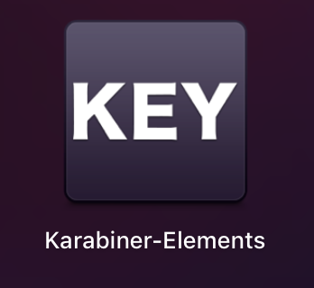

计算节点上最核心的部分，则是一个叫作 kubelet 的组件。

在 Kubernetes 项目中，kubelet 主要负责同容器运行时（比如 Docker 项目）打交道。而这个交互所依赖的，是一个称作 CRI（Container Runtime Interface）的远程调用接口，这个接口定义了容器运行时的各项核心操作，比如：启动一个容器需要的所有参数。
这也是为何，Kubernetes 项目并不关心你部署的是什么容器运行时、使用的什么技术实现，只要你的这个容器运行时能够运行标准的容器镜像，它就可以通过实现 CRI 接入到 Kubernetes 项目当中。

而具体的容器运行时，比如 Docker 项目，则一般通过 OCI 这个容器运行时规范同底层的 Linux 操作系统进行交互，即：把 CRI 请求翻译成对 Linux 操作系统的调用（操作 Linux Namespace 和 Cgroups 等）。

此外，kubelet 还通过 gRPC 协议同一个叫作 Device Plugin 的插件进行交互。这个插件，是 Kubernetes 项目用来管理 GPU 等宿主机物理设备的主要组件，也是基于 Kubernetes 项目进行机器学习训练、高性能作业支持等工作必须关注的功能。

而kubelet 的另一个重要功能，则是调用网络插件和存储插件为容器配置网络和持久化存储。这两个插件与 kubelet 进行交互的接口，分别是 CNI（Container Networking Interface）和 CSI（Container Storage Interface）。

可以说，kubelet 完全就是为了实现 Kubernetes 项目对容器的管理能力而重新实现的一个组件，与 Borg 之间并没有直接的传承关系。

# 为什么我们不把kubelet容器化

kubelet 是 Kubernetes 项目用来操作 Docker 等容器运行时的核心组件。可是，除了跟容器运行时打交道外，kubelet 在配置容器网络、管理容器数据卷时，都需要直接操作宿主机。

而如果现在 kubelet 本身就运行在一个容器里，那么直接操作宿主机就会变得很麻烦。对于网络配置来说还好，kubelet 容器可以通过不开启 Network Namespace（即 Docker 的 host network 模式）的方式，直接共享宿主机的网络栈。可是，要让 kubelet 隔着容器的 Mount Namespace 和文件系统，操作宿主机的文件系统，就有点儿困难了。

比如，如果用户想要使用 NFS 做容器的持久化数据卷，那么 kubelet 就需要在容器进行绑定挂载前，在宿主机的指定目录上，先挂载 NFS 的远程目录。

可是，这时候问题来了。由于现在 kubelet 是运行在容器里的，这就意味着它要做的这个“mount -F nfs”命令，被隔离在了一个单独的 Mount Namespace 中。即，kubelet 做的挂载操作，不能被“传播”到宿主机上。

对于这个问题，有人说，可以使用 setns() 系统调用，在宿主机的 Mount Namespace 中执行这些挂载操作；也有人说，应该让 Docker 支持一个–mnt=host 的参数。

但是，到目前为止，在容器里运行 kubelet，依然没有很好的解决办法，我也不推荐你用容器去部署 Kubernetes 项目。

正因为如此，kubeadm 选择了一种妥协方案：

把 kubelet 直接运行在宿主机上，然后使用容器部署其他的 Kubernetes 组件。

