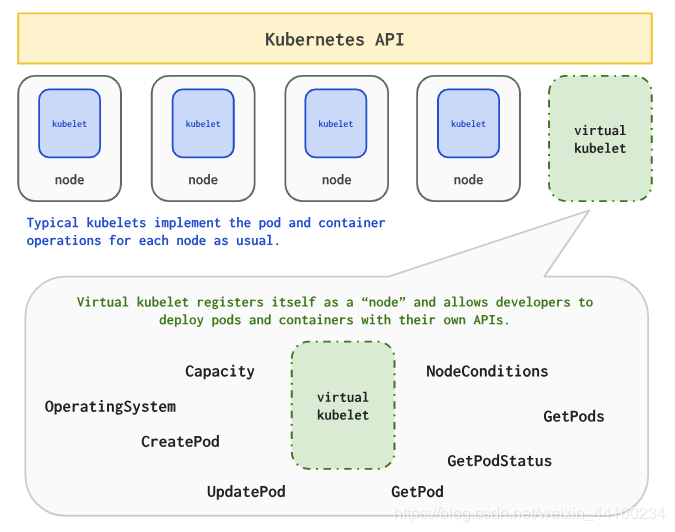

简单的介绍什么是`virtual kubelet`
<!--more-->

# 什么是virtual kubelet
[Virtual Kubelet](https://virtual-kubelet.io/)是Kubernetes kubelet的一个实现，它伪装成一个kubelet，用于将Kubernetes集群连接到其他API。这允许Kubernetes节点由其他服务支持，例如无服务器容器平台

# kubelets工作原理
一般来讲，kubelet为每个k8s节点实现Pod和容器操作。它们作为每个节点上的代理运行，无论该节点是物理服务器还是虚拟机，并在该节点上处理Pod/容器操作。kubelets将名为`PodSpec`的配置作为输入，并确保`PodSpec`中指定的容器正在运行且运行正常。

# Virtual Kubelet的工作原理
从Kubernetes API服务器的角度来看，Virtual Kubelet看起来像普通的kubelet，但其关键区别在于它们在其他地方调度容器，例如在云无服务器API中，而不是在节点上。

供应商
Virtual Kubelet支持各种供应商（Provider）：
- [Alibaba Cloud Elastic Container Instance (ECI)](https://github.com/virtual-kubelet/virtual-kubelet/tree/master/providers/alibabacloud)
- AWS Fargate
- Azure Batch
- [Azure Container Instances (ACI)](https://github.com/virtual-kubelet/virtual-kubelet/tree/master/providers/azure)
- [Kubernetes Container Runtime Interface (CRI)](https://github.com/virtual-kubelet/virtual-kubelet/tree/master/providers/cri)
- [Huawei Cloud Container Instance (CCI)](https://github.com/virtual-kubelet/virtual-kubelet/tree/master/providers/huawei)
- [Hyper.sh](https://github.com/virtual-kubelet/virtual-kubelet/tree/master/providers/hypersh)
- HashiCorp Nomad
- Service Fabric Mesh
- [vSphere Integrated Containers (VIC)](https://github.com/virtual-kubelet/virtual-kubelet/tree/master/providers/vic)

# 参考
> https://www.ctolib.com/virtual-kubelet-virtual-kubelet.html
> [部署Virtual Kubelet with ECI](https://help.aliyun.com/document_detail/97527.html)
