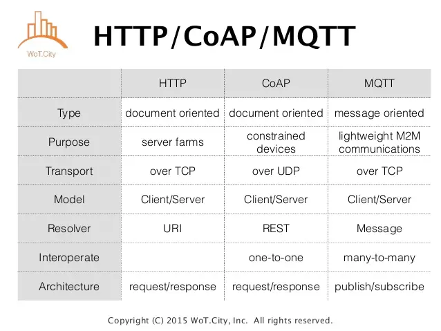

# 基础通信协议
基础通信协议方面就有两个专门的竞争协议：消息队列遥测传输( MQTT )，和受约束的应用协议(CoAP)。

它们都设计为轻量级，并仔细使用稀缺的网路资源。两者都在正确的环境中使用，但问题是，由于物联网的快速发展，一般人们不知道这些协议是什么？或何时使用？

# 什么是MQTT

MQTT的全名为`Message Queuing Telemetry Transport`，为IBM和Eurotech共同制定出来的protocol，在MQTT的官网可以看到一开始它对MQTT的介绍：

> http://mqtt.org/
>MQTT is a machine-to-machine (M2M)/"Internet of Things" connectivity protocol. It was designed as an extremely lightweight publish/subscribe messaging transport.

简单来说，它是为了物联网而设计的protocol，并且它是透过publish/subscribe的方式来做讯息传送。由于是为了物联网而设计的协定，因此它所需要的网路频宽是很低的，而所需要的硬体资源也是低的。

MQTT很像Twitter。这是一个「发布和订阅」协议。

Publish/Subscribe：
在看MQTT之前，最好要先知道Publish/Subscribe的讯息传送机制为何，这样之后在看其协定时，才会更快上手。

Publish/Subscribe有三种主要的组成元件，分别为Publisher、Subscriber以及Topic。

Publisher为讯息的来源，它会将讯息发送给Topic，而Subscriber向Topic注册，表示他们想要接收此Topic的讯息；因此当有某个Publisher对Topic发送讯息时，只要是有对此Topic注册的Subscriber，都会收到此则讯息。

它们的关系如下图：

MQTT特性
了解了Publish/Subscribe的机制之后，接着看看MQTT有哪些特性：

1. Publish/Subscribe的讯息传送模式，来提供一对多的讯息分配。
2. 使用TCP/IP来提供基本的网路连结。
3. 三种讯息传送服务的qualities：
    - "At most once"，最多一次，讯息遗失或是重复发送的状况可能会发生；这种quality适合应用在环境感测，不在意资料是否会遗失，因为下一次的资料取样很快就会被published出来。
    - "At least once"，至少一次，这种quality保证讯息会送达，只是可能会发生重复发送讯息的状况。
    - "Exactly once"，确定一次，确认讯息只会送到一次。这种quality适合用在计费系统，系统只要有重复收到资料、或是资料遗失状况发生，就会造成系统错误。
4. 由于他的header固定长度为2byte，因此可以减少封包传送时的额外负载，并减少所需的网路频宽。
5. 当异常断线发生时，会使用最后遗嘱(Last Will and Testament)的机制，通知各个感兴趣的client。

MQTT现况：
MQTT现阶段，并不是一个标准化的Protocol，还在持续改进中，目前为MQTT V3.1。不过IBM已于2013年，已经将它交给OASIS进行标准化了，并且一直以来IBM对此协定采开放、免授权费的方式，让它能够被散布，因此相信不久的将来，会成为一个主流的Protocol。

而目前支援MQTT的Client API，有Eclipse Phno Project有对MQTT client支援，其支援C、Java、Javascript、C++等等的语言，可说是支援度很高的Project。而目前已经在应用MQTT的，最知名的应该就是Facebook Message App了吧，可以参考此篇文章。

小结：
上面提到的，低频宽、低硬体需求的特性，讯息传递为Publish/Subscribe的方式，正好可以用来实现Push Notification的机制，并且能达到手持装置省电的需求，接下来会先从其Protocol开始了解，并用Client Api跑些范例来应用此Protocol。

# 什么是CoAP
CoAP(`The Constrained Application Protocol`) 目前已是IETF标准(RFC 7252) ，提出一个类似HTTP/TCP设计，但是属于轻量版的HTTP/UDP，使得其有利于感测节点进行网路传输。

CoAP主要特点：
1. CoAP是主从(Client/Server)架构，感测节点多半为CoAP Server提供资源，由CoAP Client请求读取/控制资源状态。CoAP使用UDP (port: 5683)，对于资料是否要重传或传送顺序(Reordering)全交由上层应用层来决定，对于资源有限的MCU则不需要有完整TCP/IP协定实作
2. 而CoAP同HTTP一样具有REST(Representational State Transfer)设计风格，也支援GET/PUT/POST/DELETE及URIs的请求方式。
3. CoAP采用二进位整数格式且封包标头4个byte而非HTTP使用字串格式(ASCII code)，所以封包传送时的额外负担小且不必像HTTP一样得进行耗时的字串解析处理。
4. CoAP QoS : CoAP讯息分为Confirmable或Non-Confirmable。Confirmable要求接收端须回送ACK，若没有收到ACK则重送一次。若送的是Non-Confirmable讯息，则送出端不在乎接收端是否收到。
5. CoAP加密使用DTLS (Datagram Transport Layer Security)
6. 通知机制: CoAP扩展了HTTP GET，加入了一个observe flag，使得CoAP Server能主动回传，CoAP Client所observe的资源状态。
7. NAT Issue:若感测节点在NAT后方，则必须一开始先送出请求到外部，使路由器可以接受来自外面CoAP Client的请求，例如请求资源清单。

> DTLS加密过程使用预设密钥PSK或椭圆曲线Diffie-Hellman ECDH算法，这种方法同样也是DLMS中使用的加密方法。存在的问题是，在使用ECDH时会受到DDoS的攻击，使用大的证书使得服务端瘫痪

# CoAP vs MQTT 比较
1. 都是公开标准且都是基于IP层的协定
2. 封包标头小且采用binary格式
3. CoAP属于一对一通讯，MQTT则是多对多
4. 若考虑感测节点在NAT后方的情况，由于MQTT的架构因为有中央broker的角色，MQTT Client本来就持续连接在broker，所以可以直接推播讯息，没有NAT问题。

物联网应用层通讯协定标准比较CoAP vs MQTT
机器对机器(Machine-to-Machine， M2M)通讯是物联网的一个重要运作概念。随着物联网的应用日益兴盛，M2M流量会持续增加，故针对M2M Traffic特征及其应用，M2M通讯技术应运而生。

由于物联网架构下，感测节点本身多半采用MCU，且以电池供电，故这些新的M2M协定必须考量，在有限的硬件能力及功耗等条件下，使得M2M Traffic在进行网路传输时，有较高的Throughput、低延迟、低电力耗损，甚至提供不同的QoS (Quality of Service)。

目前各家提供连结物联网装置的云端资料服务平台
AWS IoT( https://aws.amazon.com/tw/iot/)、Evrythng (https://evrythng.com/))、Xively( https://www.xively.com/ )、ThingSpeak( https:/ /thingspeak.com/ )、ThingWorx(https://www.thingworx.com/ )等及晶片厂提供的云平台，如联发科的MCS( https://mcs.mediatek.com/ )、ARM mbed Device Connector ( https://connector.mbed.com/ )等，都广泛支援CoAP及MQTT协定，故将选择此两种协定来进行说明与比较。

然而CoAP Client要取得位于NAT后方的感测节点资料，则须要在路由器上，设上设定virtual server，或port forwarding之类才能使用，不然就必须另外有第三方伺服器存在，让感测节点先连出才行。

我们看到了本文的第一个图，CoAP的网络层只有IPv6，所以如果没有物联网网关Gateway，一个IPv4的云端是无法直接访问CoAP终端的，只能由终端发起去访问固定的云端服务器。在大量的物联网终端情况下，保持连接或者会话是不现实的。因此物联网Gateway就非常重要了，需要服务器通过Gateway集成专有的寻址应用，反向建立与在NAT后的终端连接。

# 什么时候使用它们？
可能都在问的问题是，「如果他们很相似，我应该在什么时候使用哪一个；又在什么时候，使用哪一个？」

> 参考：
> 1. https://itknowledgeexchange.techtarget.com/iot-agenda/iot-developers-confused-mqtt-coap/
> 2. https://blog.csdn.net/iotisan/article/category/7184968
> 3. TCP/IP协议模型： 
