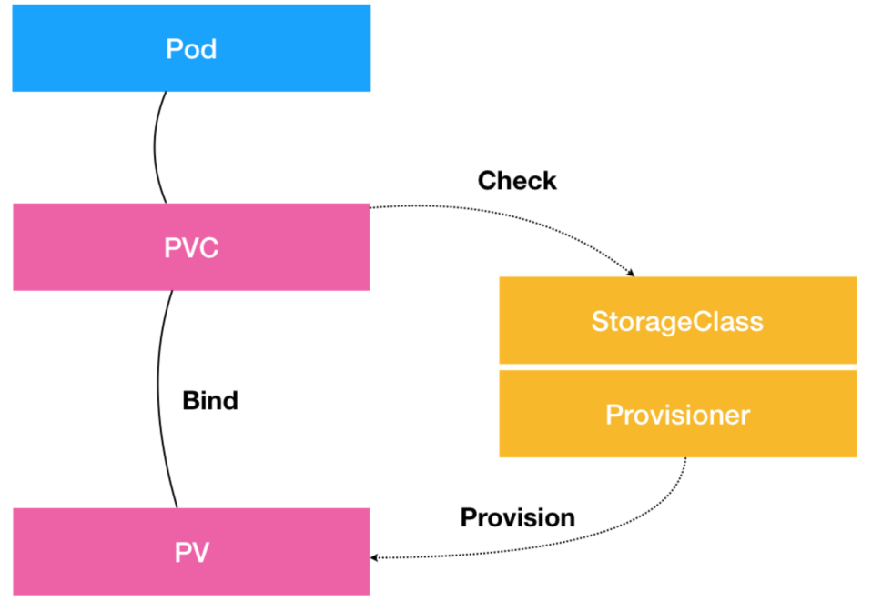

PV 描述的，是持久化存储数据卷
```
apiVersion: v1
kind: PersistentVolume
metadata:
  name: nfs
spec:
  storageClassName: manual
  capacity:
    storage: 1Gi
  accessModes:
    - ReadWriteMany
  nfs:
    server: 10.244.1.4
    path: "/"
```

PVC 描述的，则是 Pod 所希望使用的持久化存储的属性。比如，Volume 存储的大小、可读写权限等等。
PVC 对象通常由开发人员创建；或者以 PVC 模板的方式成为 StatefulSet 的一部分，然后由 StatefulSet 控制器负责创建带编号的 PVC。
```
apiVersion: v1
kind: PersistentVolumeClaim
metadata:
  name: nfs
spec:
  accessModes:
    - ReadWriteMany
  storageClassName: manual
  resources:
    requests:
      storage: 1Gi
```

而用户创建的 PVC 要真正被容器使用起来，就必须先和某个符合条件的 PV 进行绑定。这里要检查的条件，包括两部分：
1. 第一个条件，当然是 PV 和 PVC 的 spec 字段。比如，PV 的存储（storage）大小，就必须满足 PVC 的要求。
2. 而第二个条件，则是 PV 和 PVC 的 storageClassName 字段必须一样。这个机制我会在本篇文章的最后一部分专门介绍。

在成功地将 PVC 和 PV 进行绑定之后，Pod 就能够像使用 hostPath 等常规类型的 Volume 一样，在自己的 YAML 文件里声明使用这个 PVC 了
```
apiVersion: v1
kind: Pod
metadata:
  labels:
    role: web-frontend
spec:
  containers:
  - name: web
    image: nginx
    ports:
      - name: web
        containerPort: 80
    volumeMounts:
        - name: nfs
          mountPath: "/usr/share/nginx/html"
  volumes:
  - name: nfs
    persistentVolumeClaim:
      claimName: nfs
```

可以看到，Pod 需要做的，就是在 volumes 字段里声明自己要使用的 PVC 名字。接下来，等这个 Pod 创建之后，kubelet 就会把这个 PVC 所对应的 PV，也就是一个 NFS 类型的 Volume，挂载在这个 Pod 容器内的目录上.

PVC 可以理解为持久化存储的“接口”，它提供了对某种持久化存储的描述，但不提供具体的实现；而这个持久化存储的实现部分则由 PV 负责完成。

这样做的好处是，作为应用开发者，我们只需要跟 PVC 这个“接口”打交道，而不必关心具体的实现是 NFS 还是 Ceph。

========================
还有一个比较棘手的情况
在创建 Pod 的时候，系统里并没有合适的 PV 跟它定义的 PVC 绑定，也就是说此时容器想要使用的 Volume 不存在。这时候，Pod 的启动就会报错。

但是，过了一会儿，运维人员也发现了这个情况，所以他赶紧创建了一个对应的 PV。这时候，我们当然希望 Kubernetes 能够再次完成 PVC 和 PV 的绑定操作，从而启动 Pod。

所以在 Kubernetes 中，实际上存在着一个专门处理持久化存储的控制器，叫作 Volume Controller。这个 Volume Controller 维护着多个控制循环，其中有一个循环，扮演的就是撮合 PV 和 PVC 的“红娘”的角色。它的名字叫作 PersistentVolumeController。

PersistentVolumeController 会不断地查看当前每一个 PVC，是不是已经处于 Bound（已绑定）状态。如果不是，那它就会遍历所有的、可用的 PV，并尝试将其与这个“单身”的 PVC 进行绑定。这样，Kubernetes 就可以保证用户提交的每一个 PVC，只要有合适的 PV 出现，它就能够很快进入绑定状态，从而结束“单身”之旅。

- 所谓容器的 Volume，其实就是将一个宿主机上的目录，跟一个容器里的目录绑定挂载在了一起。
- 而所谓的“持久化 Volume”，指的就是这个宿主机上的目录，具备“持久性”。
  - 这个目录里面的内容，既不会因为容器的删除而被清理掉，也不会跟当前的宿主机绑定。这样，当容器被重启或者在其他节点上重建出来之后，它仍然能够通过挂载这个 Volume，访问到这些内容。
- hostPath 和 emptyDir 类型的 Volume 并不具备这个特征：它们既有可能被 kubelet 清理掉，也不能被“迁移”到其他节点上。

所以，大多数情况下，持久化 Volume 的实现，往往依赖于一个远程存储服务，比如：远程文件存储（比如，NFS、GlusterFS）、远程块存储（比如，公有云提供的远程磁盘）等等。

而 Kubernetes 需要做的工作，就是使用这些存储服务，来为容器准备一个持久化的宿主机目录，以供将来进行绑定挂载时使用。而所谓“持久化”，指的是容器在这个目录里写入的文件，都会保存在远程存储中，从而使得这个目录具备了“持久性”。

这个准备“持久化”宿主机目录的过程，我们可以抽象为“两阶段处理”。
第一阶段:为虚拟机挂在远程磁盘
```
/var/lib/kubelet/pods/<Pod 的 ID>/volumes/kubernetes.io~<Volume 类型 >/<Volume 名字 >
```
第二阶段:格式化并挂载磁盘
```
# 通过 lsblk 命令获取磁盘设备 ID
$ sudo lsblk
# 格式化成 ext4 格式
$ sudo mkfs.ext4 -m 0 -F -E lazy_itable_init=0,lazy_journal_init=0,discard /dev/< 磁盘设备 ID>
# 挂载到挂载点
$ sudo mkdir -p /var/lib/kubelet/pods/<Pod 的 ID>/volumes/kubernetes.io~<Volume 类型 >/<Volume 名字 >
```

在具体的 Volume 插件的实现接口上，Kubernetes 分别给这两个阶段提供了两种不同的参数列表：
对于“第一阶段”（Attach），Kubernetes 提供的可用参数是 nodeName，即宿主机的名字。
而对于“第二阶段”（Mount），Kubernetes 提供的可用参数是 dir，即 Volume 的宿主机目录。
所以，作为一个存储插件，你只需要根据自己的需求进行选择和实现即可。

而经过了“两阶段处理”，我们就得到了一个“持久化”的 Volume 宿主机目录。所以，接下来，kubelet 只要把这个 Volume 目录通过 CRI 里的 Mounts 参数，传递给 Docker，然后就可以为 Pod 里的容器挂载这个“持久化”的 Volume 了。其实，这一步相当于执行了如下所示的命令：
```
docker run -v /var/lib/kubelet/pods/<Pod 的 ID>/volumes/kubernetes.io~<Volume 类型 >/<Volume 名字 >:/< 容器内的目标目录 > 我的镜像 ...
```


以上就是 Kubernetes 处理 PV 的具体原理了。

> 对应地，在删除一个 PV 的时候，Kubernetes 也需要 Unmount 和 Dettach 两个阶段来处理。这个过程我就不再详细介绍了，执行“反向操作”即可。


总结:
关于 PV 的“两阶段处理”流程，是靠独立于 kubelet 主控制循环（Kubelet Sync Loop）之外的两个控制循环来实现的。

其中，“第一阶段”的 Attach（以及 Dettach）操作，是由 Volume Controller 负责维护的，这个控制循环的名字叫作：AttachDetachController。而它的作用，就是不断地检查每一个 Pod 对应的 PV，和这个 Pod 所在宿主机之间挂载情况。从而决定，是否需要对这个 PV 进行 Attach（或者 Dettach）操作。

需要注意，作为一个 Kubernetes 内置的控制器，Volume Controller 自然是 kube-controller-manager 的一部分。所以，AttachDetachController 也一定是运行在 Master 节点上的。当然，Attach 操作只需要调用公有云或者具体存储项目的 API，并不需要在具体的宿主机上执行操作，所以这个设计没有任何问题。

而“第二阶段”的 Mount（以及 Unmount）操作，必须发生在 Pod 对应的宿主机上，所以它必须是 kubelet 组件的一部分。这个控制循环的名字，叫作：VolumeManagerReconciler，它运行起来之后，是一个独立于 kubelet 主循环的 Goroutine。

通过这样将 Volume 的处理同 kubelet 的主循环解耦，Kubernetes 就避免了这些耗时的远程挂载操作拖慢 kubelet 的主控制循环，进而导致 Pod 的创建效率大幅下降的问题。实际上，kubelet 的一个主要设计原则，就是它的主控制循环绝对不可以被 block。


# storageclass
Kubernetes 为我们提供了一套可以自动创建 PV 的机制，即：Dynamic Provisioning。用来解决上面的人工管理 PV 的方式`Static Provisioning`.

Dynamic Provisioning 机制工作的核心，在于一个名叫 StorageClass 的 API 对象。

而 StorageClass 对象的作用，其实就是创建 PV 的模板。

具体地说，StorageClass 对象会定义如下两个部分内容：
- 第一，PV 的属性。比如，存储类型、Volume 的大小等等。
- 第二，创建这种 PV 需要用到的存储插件。比如，Ceph 等等。


有了这样两个信息之后，Kubernetes 就能够根据用户提交的 PVC，找到一个对应的 StorageClass 了。然后，Kubernetes 就会调用该 StorageClass 声明的存储插件，创建出需要的 PV。

举个例子，假如我们的 Volume 的类型是 GCE 的 Persistent Disk 的话，运维人员就需要定义一个如下所示的 StorageClass：
```
apiVersion: storage.k8s.io/v1
kind: StorageClass
metadata:
  name: block-service
provisioner: kubernetes.io/gce-pd
parameters:
  type: pd-ssd
```

>由于需要使用 GCE Persistent Disk，上面这个例子只有在 GCE 提供的 Kubernetes 服务里才能实践。

有了 Dynamic Provisioning 机制，运维人员只需要在 Kubernetes 集群里创建出数量有限的 StorageClass 对象就可以了。这就好比，运维人员在 Kubernetes 集群里创建出了各种各样的 PV 模板。这时候，当开发人员提交了包含 StorageClass 字段的 PVC 之后，Kubernetes 就会根据这个 StorageClass 创建出对应的 PV。

>Kubernetes 的官方文档里已经列出了默认支持 Dynamic Provisioning 的内置存储插件。而对于不在文档里的插件，比如 NFS，或者其他非内置存储插件，可以通过`kubernetes-incubator/external-storage`这个库来自己编写一个外部插件完成这个工作。像之前部署的 Rook，已经内置了 `external-storage` 的实现，所以 Rook 是完全支持 `Dynamic Provisioning` 特性的。

需要注意的是，StorageClass 并不是专门为了 Dynamic Provisioning 而设计的。



从图中可以看到，在这个体系中：
- PVC 描述的，是 Pod 想要使用的持久化存储的属性，比如存储的大小、读写权限等。
- PV 描述的，则是一个具体的 Volume 的属性，比如 Volume 的类型、挂载目录、远程存储服务器地址等。
- StorageClass 的作用，则是充当 PV 的模板。并且，只有同属于一个 StorageClass 的 PV 和 PVC，才可以绑定在一起。
- StorageClass 的另一个重要作用，是指定 PV 的 Provisioner（存储插件）。这时候，如果你的存储插件支持 Dynamic Provisioning 的话，Kubernetes 就可以自动为你创建 PV 了。
