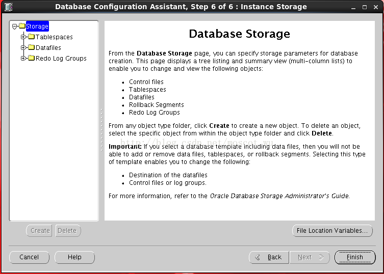

给出11gRAC添加节点步骤，以供参考
<!--more-->

> 参考
https://docs.oracle.com/cd/E11882_01/rac.112/e41959/adddelclusterware.htm#CWADD90992

# 概述
## 操作系统与软件版本
- 数据库版本11.2.0.4
- 操作系统版本：oracle linux Enterprise-R6-U8-Server-x86_64

## 添加节点步骤如下：
1. 主机环境准备
2. 添加集群软件
3. 添加数据库软件
4. 添加数据库实例
5. 检查

## 1. 主机环境准备

### 1.1 配置hosts
以下是每一台主机的/etc/hosts，保证新增的主机/etc/hosts文件和其他两台一致，开始的时候ORACLE_HOME=/u01/app/11.2.0/grid
```
# cat /etc/hosts
127.0.0.1   localhost localhost.localdomain localhost4 localhost4.localdomain4
::1         localhost localhost.localdomain localhost6 localhost6.localdomain6

10.0.1.101	host01.qmx.com	host01
10.0.1.102	host02.qmx.com	host02
10.0.1.103	host03.qmx.com	host03

192.168.56.101	host01-priv
192.168.56.102	host02-priv
192.168.56.103	host03-priv

10.0.1.105	host01-vip
10.0.1.106	host02-vip
10.0.1.107	host03-vip

10.0.1.201	cluster01-scan.qmx.com	cluster01-scan
#10.0.1.202 	cluster01-scan.qmx.com	cluster01-scan
#10.0.1.203 	cluster01-scan.qmx.com	cluster01-scan
```

没有用到DNS服务器，均在/etc/hosts 文件中写死了配置，所以cluster01-scan只有一组，建议实际配置为三组

### 1.2 关闭防火墙等
关闭防火墙
```
# service iptables stop
# chkconfig iptables off
```


关闭selinux
```
Selinux=disable
```


关闭NetWorkerManager

```
service NetworkerManager stop
chkconfig NetworkerManager off
```

> 如果不关闭可能在安装的时候报PRVF-7617的错误

### 1.3 配置ssh等效性

在host03  作如下操作，host01和host02由于已经有ssh的等效性，所以记得最后把authorized_keys文件拷贝到host01和host02，记得用grid用户
```
[grid@host03 ~]$mkdir /home/oracle/.ssh
[grid@host03 ~]$cd /home/oracle/.ssh
[grid@host03 ~]$ssh-keygen -t rsa
[grid@host03 ~]$scp grid@host01:/home/oracle/.ssh/authorized_keys /home/oracle/.ssh/
[grid@host03 ~]$cat id_rsa.pub >> authorized_keys
[grid@host03 ~]$scp authorized_keys grid@host01:/home/oracle/.ssh/authorized_keys
[grid@host03 ~]$scp authorized_keys grid@host02:/home/oracle/.ssh/authorized_keys
[grid@host03 ~]$ ssh host01 date
```

> 以上步骤在oracle用户也需要做一遍，后面要创建实例也是需要的。SSH校验时偶尔会出现以下错误

### 1.4 修改内核参数

### 1.5 创建相应的用户和组
```
groupadd -g 501 oinstall
groupadd -g 502 dba
groupadd -g 503 oper
groupadd -g 504 asmadmin
groupadd -g 505 asmoper
groupadd -g 506 asmdba

useradd -g oinstall -G dba,asmdba,oper,asmadmin,asmoper oracle
passwd oracle

useradd -g oinstall -G asmadmin,asmdba,asmoper,oper,dba grid
passwd oracle
```


### 1.6 安装之前的检查
在host01执行并生成校验准备命令
```
[grid@host01 bin]$ cluvfy stage -pre nodeadd -n host03 -fixup
Performing pre-checks for node addition
Checking node reachability...
Node reachability check passed from node "host01"
Checking user equivalence...
User equivalence check passed for user "grid"
Checking CRS integrity...
Clusterware version consistency passed
CRS integrity check passed
Checking shared resources...
Checking CRS home location...
"/u01/app/11.2.0/grid" is shared
Shared resources check for node addition passed
Checking node connectivity...
Checking hosts config file...
Verification of the hosts config file successful
Check: Node connectivity for interface "eth0"
Node connectivity passed for interface "eth0"
TCP connectivity check passed for subnet "10.0.1.0"
Check: Node connectivity for interface "eth1"
Node connectivity passed for interface "eth1"
TCP connectivity check passed for subnet "192.168.56.0"
Checking subnet mask consistency...
Subnet mask consistency check passed for subnet "10.0.1.0".
Subnet mask consistency check passed for subnet "192.168.56.0".
Subnet mask consistency check passed.
Node connectivity check passed
Checking multicast communication...
Checking subnet "10.0.1.0" for multicast communication with multicast group "230.0.1.0"...
Check of subnet "10.0.1.0" for multicast communication with multicast group "230.0.1.0" passed.
Checking subnet "192.168.56.0" for multicast communication with multicast group "230.0.1.0"...
Check of subnet "192.168.56.0" for multicast communication with multicast group "230.0.1.0" passed.
Check of multicast communication passed.
Total memory check passed
Available memory check passed
Swap space check passed
Free disk space check passed for "host03:/u01/app/11.2.0/grid,host03:/tmp"
Free disk space check passed for "host01:/u01/app/11.2.0/grid,host01:/tmp"
Check for multiple users with UID value 501 passed
User existence check passed for "grid"
Run level check passed
Hard limits check passed for "maximum open file descriptors"
Soft limits check passed for "maximum open file descriptors"
Hard limits check passed for "maximum user processes"
Soft limits check passed for "maximum user processes"
System architecture check passed
WARNING:
PRVF-7524 : Kernel version is not consistent across all the nodes.
Kernel version = "4.1.12-94.2.1.el6uek.x86_64" found on nodes: host01.
Kernel version = "4.1.12-94.3.4.el6uek.x86_64" found on nodes: host03.
Kernel version check passed
Kernel parameter check passed for "semmsl"
Kernel parameter check passed for "semmns"
Kernel parameter check passed for "semopm"
Kernel parameter check passed for "semmni"
Kernel parameter check passed for "shmmax"
Kernel parameter check passed for "shmmni"
Kernel parameter check passed for "shmall"
Kernel parameter check passed for "file-max"
Kernel parameter check passed for "ip_local_port_range"
Kernel parameter check passed for "rmem_default"
Kernel parameter check passed for "rmem_max"
Kernel parameter check passed for "wmem_default"
Kernel parameter check passed for "wmem_max"
Kernel parameter check passed for "aio-max-nr"
Package existence check passed for "binutils"
Package existence check passed for "compat-libcap1"
Package existence check passed for "compat-libstdc++-33(x86_64)"
Package existence check passed for "libgcc(x86_64)"
Package existence check passed for "libstdc++(x86_64)"
Package existence check passed for "libstdc++-devel(x86_64)"
Package existence check passed for "sysstat"
Package existence check passed for "gcc"
Package existence check passed for "gcc-c++"
Package existence check passed for "ksh"
Package existence check passed for "make"
Package existence check passed for "glibc(x86_64)"
Package existence check passed for "glibc-devel(x86_64)"
Package existence check passed for "libaio(x86_64)"
Package existence check passed for "libaio-devel(x86_64)"
Check for multiple users with UID value 0 passed
Current group ID check passed
Starting check for consistency of primary group of root user
Check for consistency of root user's primary group passed
Checking OCR integrity...
OCR integrity check passed
Checking Oracle Cluster Voting Disk configuration...
Oracle Cluster Voting Disk configuration check passed
Time zone consistency check passed
Starting Clock synchronization checks using Network Time Protocol(NTP)...
NTP Configuration file check started...
No NTP Daemons or Services were found to be running
Clock synchronization check using Network Time Protocol(NTP) passed
User "grid" is not part of "root" group. Check passed
Checking consistency of file "/etc/resolv.conf" across nodes
File "/etc/resolv.conf" does not have both domain and search entries defined
domain entry in file "/etc/resolv.conf" is consistent across nodes
search entry in file "/etc/resolv.conf" is consistent across nodes
All nodes have one search entry defined in file "/etc/resolv.conf"
PRVF-5636 : The DNS response time for an unreachable node exceeded "15000" ms on following nodes: host01,host03
File "/etc/resolv.conf" is not consistent across nodes
Checking integrity of name service switch configuration file "/etc/nsswitch.conf" ...
Check for integrity of name service switch configuration file "/etc/nsswitch.conf" passed
Fixup information has been generated for following node(s):
host03
Please run the following script on each node as "root" user to execute the fixups:
'/tmp/CVU_11.2.0.4.0_grid/runfixup.sh'
Pre-check for node addition was unsuccessful on all the nodes.
```

## 2. 添加集群软件
### 2.1 在host01执行`addnode`操作

以上检查部分报错可以忽略，如`/etc/resolv.conf`报错，我没有用DNS所以忽略。DNS服务器超时也可以忽略。此时要先导入`ignore_preaddnode_checks`环境变量，否则后面的命令无法安装

```
[grid@host01 ~]$ export IGNORE_PREADDNODE_CHECKS=Y
[grid@host01 ~]$
[grid@host01 ~]$ cd /u01/app/11.2.0/grid/oui/bin/
[grid@host01 bin]$ ./addNode.sh "CLUSTER_NEW_NODES={host03}" "CLUSTER_NEW_VIRTUAL_HOSTNAMES={host03-vip}"
Starting Oracle Universal Installer...
Checking swap space: must be greater than 500 MB.   Actual 3932 MB    Passed
Oracle Universal Installer, Version 11.2.0.4.0 Production
Copyright (C) 1999, 2013, Oracle. All rights reserved.
Performing tests to see whether nodes host02,host03 are available
............................................................... 100% Done..
-----------------------------------------------------------------------------
Cluster Node Addition Summary
Global Settings
   Source: /u01/app/11.2.0/grid
   New Nodes
Space Requirements
   New Nodes
      host03
         /: Required 5.07GB : Available 27.84GB
Installed Products
   Product Names
      Oracle Grid Infrastructure 11g 11.2.0.4.0
      Java Development Kit 1.5.0.51.10
      Installer SDK Component 11.2.0.4.0
      Oracle One-Off Patch Installer 11.2.0.3.4
      Oracle Universal Installer 11.2.0.4.0
      Oracle RAC Required Support Files-HAS 11.2.0.4.0
      Oracle USM Deconfiguration 11.2.0.4.0
      Oracle Configuration Manager Deconfiguration 10.3.1.0.0
      Enterprise Manager Common Core Files 10.2.0.4.5
      Oracle DBCA Deconfiguration 11.2.0.4.0
      Oracle RAC Deconfiguration 11.2.0.4.0
      Oracle Quality of Service Management (Server) 11.2.0.4.0
      Installation Plugin Files 11.2.0.4.0
      Universal Storage Manager Files 11.2.0.4.0
      Oracle Text Required Support Files 11.2.0.4.0
      Automatic Storage Management Assistant 11.2.0.4.0
      Oracle Database 11g Multimedia Files 11.2.0.4.0
      Oracle Multimedia Java Advanced Imaging 11.2.0.4.0
      Oracle Globalization Support 11.2.0.4.0
      Oracle Multimedia Locator RDBMS Files 11.2.0.4.0
      Oracle Core Required Support Files 11.2.0.4.0
      Bali Share 1.1.18.0.0
      Oracle Database Deconfiguration 11.2.0.4.0
      Oracle Quality of Service Management (Client) 11.2.0.4.0
      Expat libraries 2.0.1.0.1
      Oracle Containers for Java 11.2.0.4.0
      Perl Modules 5.10.0.0.1
      Secure Socket Layer 11.2.0.4.0
      Oracle JDBC/OCI Instant Client 11.2.0.4.0
      Oracle Multimedia Client Option 11.2.0.4.0
      LDAP Required Support Files 11.2.0.4.0
      Character Set Migration Utility 11.2.0.4.0
      Perl Interpreter 5.10.0.0.2
      PL/SQL Embedded Gateway 11.2.0.4.0
      OLAP SQL Scripts 11.2.0.4.0
      Database SQL Scripts 11.2.0.4.0
      Oracle Extended Windowing Toolkit 3.4.47.0.0
      SSL Required Support Files for InstantClient 11.2.0.4.0
      SQL*Plus Files for Instant Client 11.2.0.4.0
      Oracle Net Required Support Files 11.2.0.4.0
      Oracle Database User Interface 2.2.13.0.0
      RDBMS Required Support Files for Instant Client 11.2.0.4.0
      RDBMS Required Support Files Runtime 11.2.0.4.0
      XML Parser for Java 11.2.0.4.0
      Oracle Security Developer Tools 11.2.0.4.0
      Oracle Wallet Manager 11.2.0.4.0
      Enterprise Manager plugin Common Files 11.2.0.4.0
      Platform Required Support Files 11.2.0.4.0
      Oracle JFC Extended Windowing Toolkit 4.2.36.0.0
      RDBMS Required Support Files 11.2.0.4.0
      Oracle Ice Browser 5.2.3.6.0
      Oracle Help For Java 4.2.9.0.0
      Enterprise Manager Common Files 10.2.0.4.5
      Deinstallation Tool 11.2.0.4.0
      Oracle Java Client 11.2.0.4.0
      Cluster Verification Utility Files 11.2.0.4.0
      Oracle Notification Service (eONS) 11.2.0.4.0
      Oracle LDAP administration 11.2.0.4.0
      Cluster Verification Utility Common Files 11.2.0.4.0
      Oracle Clusterware RDBMS Files 11.2.0.4.0
      Oracle Locale Builder 11.2.0.4.0
      Oracle Globalization Support 11.2.0.4.0
      Buildtools Common Files 11.2.0.4.0
      HAS Common Files 11.2.0.4.0
      SQL*Plus Required Support Files 11.2.0.4.0
      XDK Required Support Files 11.2.0.4.0
      Agent Required Support Files 10.2.0.4.5
      Parser Generator Required Support Files 11.2.0.4.0
      Precompiler Required Support Files 11.2.0.4.0
      Installation Common Files 11.2.0.4.0
      Required Support Files 11.2.0.4.0
      Oracle JDBC/THIN Interfaces 11.2.0.4.0
      Oracle Multimedia Locator 11.2.0.4.0
      Oracle Multimedia 11.2.0.4.0
      Assistant Common Files 11.2.0.4.0
      Oracle Net 11.2.0.4.0
      PL/SQL 11.2.0.4.0
      HAS Files for DB 11.2.0.4.0
      Oracle Recovery Manager 11.2.0.4.0
      Oracle Database Utilities 11.2.0.4.0
      Oracle Notification Service 11.2.0.3.0
      SQL*Plus 11.2.0.4.0
      Oracle Netca Client 11.2.0.4.0
      Oracle Advanced Security 11.2.0.4.0
      Oracle JVM 11.2.0.4.0
      Oracle Internet Directory Client 11.2.0.4.0
      Oracle Net Listener 11.2.0.4.0
      Cluster Ready Services Files 11.2.0.4.0
      Oracle Database 11g 11.2.0.4.0
-----------------------------------------------------------------------------
Instantiating scripts for add node (Friday, July 21, 2018 12:05:44 AM CST)
.                                                                 1% Done.
Instantiation of add node scripts complete
Copying to remote nodes (Friday, July 21, 2018 12:08:48 AM CST)
...............................................................................................                                 96% Done.
Home copied to new nodes
Saving inventory on nodes (Friday, July 21, 2018 12:09:06 AM CST)
.                                                               100% Done.
Save inventory complete
WARNING:A new inventory has been created on one or more nodes in this session. However, it has not yet been registered as the central inventory of this system.
To register the new inventory please run the script at '/u01/app/oraInventory/orainstRoot.sh' with root privileges on nodes 'host03'.
If you do not register the inventory, you may not be able to update or patch the products you installed.
The following configuration scripts need to be executed as the "root" user in each new cluster node. Each script in the list below is followed by a list of nodes.
/u01/app/oraInventory/orainstRoot.sh #On nodes host03
/u01/app/11.2.0/grid/root.sh #On nodes host03
To execute the configuration scripts:
    1. Open a terminal window
    2. Log in as "root"
    3. Run the scripts in each cluster node

The Cluster Node Addition of /u01/app/11.2.0/grid was successful.
Please check '/tmp/silentInstall.log' for more details.
```


### 2.2 在host03上执行`orainstRoot.sh`脚本
```
[root@host03 ~]# /u01/app/oraInventory/orainstRoot.sh
Creating the Oracle inventory pointer file (/etc/oraInst.loc)
Changing permissions of /u01/app/oraInventory.
Adding read,write permissions for group.
Removing read,write,execute permissions for world.
Changing groupname of /u01/app/oraInventory to oinstall.
The execution of the script is complete.
[root@host03 ~]# /u01/app/11.2.0/grid/root.sh
Performing root user operation for Oracle 11g
The following environment variables are set as:
    ORACLE_OWNER= grid
    ORACLE_HOME=  /u01/app/11.2.0/grid
Enter the full pathname of the local bin directory: [/usr/local/bin]:
   Copying dbhome to /usr/local/bin ...
   Copying oraenv to /usr/local/bin ...
   Copying coraenv to /usr/local/bin ...
Creating /etc/oratab file...
Entries will be added to the /etc/oratab file as needed by
Database Configuration Assistant when a database is created
Finished running generic part of root script.
Now product-specific root actions will be performed.
Using configuration parameter file: /u01/app/11.2.0/grid/crs/install/crsconfig_params
Creating trace directory
User ignored Prerequisites during installation
Installing Trace File Analyzer
OLR initialization - successful
Adding Clusterware entries to upstart
CRS-4402: The CSS daemon was started in exclusive mode but found an active CSS daemon on node host01, number 1, and is terminating
An active cluster was found during exclusive startup, restarting to join the cluster
clscfg: EXISTING configuration version 5 detected.
clscfg: version 5 is 11g Release 2.
Successfully accumulated necessary OCR keys.
Creating OCR keys for user 'root', privgrp 'root'..
Operation successful.
Preparing packages for installation...
cvuqdisk-1.0.9-1
Configure Oracle Grid Infrastructure for a Cluster ... succeeded
```

### 2.3 检查集群的状态
配置成功，检查节点是否正常添加到GI，在任意一台主机上执行，查看后台进程是否正常
```
$ crs_stat -t
```

如上则正常添加，在这里有时候会因为网络原因导致配置host03所有步骤均对 但是host03最后只是把软件安装成功，进程却无法注册的现象，注意多检查预先检查时的报错，确保网络配置成功。

## 3.安装数据库软件

### 3.1 给oracle用户配置ssh信任
首先在host03的oracle用户配置三台机器的ssh互信，配制方法见上面的grid用户配置方法

### 3.2 在 host01 下执行`addNode`脚本
```
[oracle@host01 .ssh]$ $ORACLE_HOME/oui/bin/addNode.sh "CLUSTER_NEW_NODES={host03}"
Performing pre-checks for node addition 
Checking node reachability...
Node reachability check passed from node "host01"
Checking user equivalence...
User equivalence check passed for user "oracle"
WARNING: 
Node "host03" already appears to be part of cluster
Pre-check for node addition was successful. 
Starting Oracle Universal Installer...
Checking swap space: must be greater than 500 MB.   Actual 3342 MB    Passed
Oracle Universal Installer, Version 11.2.0.4.0 Production
Copyright (C) 1999, 2013, Oracle. All rights reserved.
Performing tests to see whether nodes host02,host03 are available
............................................................... 100% Done..
-----------------------------------------------------------------------------
Cluster Node Addition Summary
Global Settings
   Source: /u01/app/oracle/product/11.2.0/dbhome_1
   New Nodes
Space Requirements
   New Nodes
      host03
         /: Required 4.29GB : Available 23.93GB
Installed Products
   Product Names
      Oracle Database 11g 11.2.0.4.0 
      Java Development Kit 1.5.0.51.10 
      Installer SDK Component 11.2.0.4.0 
      Oracle One-Off Patch Installer 11.2.0.3.4 
      Oracle Universal Installer 11.2.0.4.0 
      Oracle USM Deconfiguration 11.2.0.4.0 
      Oracle Configuration Manager Deconfiguration 10.3.1.0.0 
      Oracle DBCA Deconfiguration 11.2.0.4.0 
      Oracle RAC Deconfiguration 11.2.0.4.0 
      Oracle Database Deconfiguration 11.2.0.4.0 
      Oracle Configuration Manager Client 10.3.2.1.0 
      Oracle Configuration Manager 10.3.8.1.0 
      Oracle ODBC Driverfor Instant Client 11.2.0.4.0 
      LDAP Required Support Files 11.2.0.4.0 
      SSL Required Support Files for InstantClient 11.2.0.4.0 
      Bali Share 1.1.18.0.0 
      Oracle Extended Windowing Toolkit 3.4.47.0.0 
      Oracle JFC Extended Windowing Toolkit 4.2.36.0.0 
      Oracle Real Application Testing 11.2.0.4.0 
      Oracle Database Vault J2EE Application 11.2.0.4.0 
      Oracle Label Security 11.2.0.4.0 
      Oracle Data Mining RDBMS Files 11.2.0.4.0 
      Oracle OLAP RDBMS Files 11.2.0.4.0 
      Oracle OLAP API 11.2.0.4.0 
      Platform Required Support Files 11.2.0.4.0 
      Oracle Database Vault option 11.2.0.4.0 
      Oracle RAC Required Support Files-HAS 11.2.0.4.0 
      SQL*Plus Required Support Files 11.2.0.4.0 
      Oracle Display Fonts 9.0.2.0.0 
      Oracle Ice Browser 5.2.3.6.0 
      Oracle JDBC Server Support Package 11.2.0.4.0 
      Oracle SQL Developer 11.2.0.4.0 
      Oracle Application Express 11.2.0.4.0 
      XDK Required Support Files 11.2.0.4.0 
      RDBMS Required Support Files for Instant Client 11.2.0.4.0 
      SQLJ Runtime 11.2.0.4.0 
      Database Workspace Manager 11.2.0.4.0 
      RDBMS Required Support Files Runtime 11.2.0.4.0 
      Oracle Globalization Support 11.2.0.4.0 
      Exadata Storage Server 11.2.0.1.0 
      Provisioning Advisor Framework 10.2.0.4.3 
      Enterprise Manager Database Plugin -- Repository Support 11.2.0.4.0 
      Enterprise Manager Repository Core Files 10.2.0.4.5 
      Enterprise Manager Database Plugin -- Agent Support 11.2.0.4.0 
      Enterprise Manager Grid Control Core Files 10.2.0.4.5 
      Enterprise Manager Common Core Files 10.2.0.4.5 
      Enterprise Manager Agent Core Files 10.2.0.4.5 
      RDBMS Required Support Files 11.2.0.4.0 
      regexp 2.1.9.0.0 
      Agent Required Support Files 10.2.0.4.5 
      Oracle 11g Warehouse Builder Required Files 11.2.0.4.0 
      Oracle Notification Service (eONS) 11.2.0.4.0 
      Oracle Text Required Support Files 11.2.0.4.0 
      Parser Generator Required Support Files 11.2.0.4.0 
      Oracle Database 11g Multimedia Files 11.2.0.4.0 
      Oracle Multimedia Java Advanced Imaging 11.2.0.4.0 
      Oracle Multimedia Annotator 11.2.0.4.0 
      Oracle JDBC/OCI Instant Client 11.2.0.4.0 
      Oracle Multimedia Locator RDBMS Files 11.2.0.4.0 
      Precompiler Required Support Files 11.2.0.4.0 
      Oracle Core Required Support Files 11.2.0.4.0 
      Sample Schema Data 11.2.0.4.0 
      Oracle Starter Database 11.2.0.4.0 
      Oracle Message Gateway Common Files 11.2.0.4.0 
      Oracle XML Query 11.2.0.4.0 
      XML Parser for Oracle JVM 11.2.0.4.0 
      Oracle Help For Java 4.2.9.0.0 
      Installation Plugin Files 11.2.0.4.0 
      Enterprise Manager Common Files 10.2.0.4.5 
      Expat libraries 2.0.1.0.1 
      Deinstallation Tool 11.2.0.4.0 
      Oracle Quality of Service Management (Client) 11.2.0.4.0 
      Perl Modules 5.10.0.0.1 
      JAccelerator (COMPANION) 11.2.0.4.0 
      Oracle Containers for Java 11.2.0.4.0 
      Perl Interpreter 5.10.0.0.2 
      Oracle Net Required Support Files 11.2.0.4.0 
      Secure Socket Layer 11.2.0.4.0 
      Oracle Universal Connection Pool 11.2.0.4.0 
      Oracle JDBC/THIN Interfaces 11.2.0.4.0 
      Oracle Multimedia Client Option 11.2.0.4.0 
      Oracle Java Client 11.2.0.4.0 
      Character Set Migration Utility 11.2.0.4.0 
      Oracle Code Editor 1.2.1.0.0I 
      PL/SQL Embedded Gateway 11.2.0.4.0 
      OLAP SQL Scripts 11.2.0.4.0 
      Database SQL Scripts 11.2.0.4.0 
      Oracle Locale Builder 11.2.0.4.0 
      Oracle Globalization Support 11.2.0.4.0 
      SQL*Plus Files for Instant Client 11.2.0.4.0 
      Required Support Files 11.2.0.4.0 
      Oracle Database User Interface 2.2.13.0.0 
      Oracle ODBC Driver 11.2.0.4.0 
      Oracle Notification Service 11.2.0.3.0 
      XML Parser for Java 11.2.0.4.0 
      Oracle Security Developer Tools 11.2.0.4.0 
      Oracle Wallet Manager 11.2.0.4.0 
      Cluster Verification Utility Common Files 11.2.0.4.0 
      Oracle Clusterware RDBMS Files 11.2.0.4.0 
      Oracle UIX 2.2.24.6.0 
      Enterprise Manager plugin Common Files 11.2.0.4.0 
      HAS Common Files 11.2.0.4.0 
      Precompiler Common Files 11.2.0.4.0 
      Installation Common Files 11.2.0.4.0 
      Oracle Help for the  Web 2.0.14.0.0 
      Oracle LDAP administration 11.2.0.4.0 
      Buildtools Common Files 11.2.0.4.0 
      Assistant Common Files 11.2.0.4.0 
      Oracle Recovery Manager 11.2.0.4.0 
      PL/SQL 11.2.0.4.0 
      Generic Connectivity Common Files 11.2.0.4.0 
      Oracle Database Gateway for ODBC 11.2.0.4.0 
      Oracle Programmer 11.2.0.4.0 
      Oracle Database Utilities 11.2.0.4.0 
      Enterprise Manager Agent 10.2.0.4.5 
      SQL*Plus 11.2.0.4.0 
      Oracle Netca Client 11.2.0.4.0 
      Oracle Multimedia Locator 11.2.0.4.0 
      Oracle Call Interface (OCI) 11.2.0.4.0 
      Oracle Multimedia 11.2.0.4.0 
      Oracle Net 11.2.0.4.0 
      Oracle XML Development Kit 11.2.0.4.0 
      Oracle Internet Directory Client 11.2.0.4.0 
      Database Configuration and Upgrade Assistants 11.2.0.4.0 
      Oracle JVM 11.2.0.4.0 
      Oracle Advanced Security 11.2.0.4.0 
      Oracle Net Listener 11.2.0.4.0 
      Oracle Enterprise Manager Console DB 11.2.0.4.0 
      HAS Files for DB 11.2.0.4.0 
      Oracle Text 11.2.0.4.0 
      Oracle Net Services 11.2.0.4.0 
      Oracle Database 11g 11.2.0.4.0 
      Oracle OLAP 11.2.0.4.0 
      Oracle Spatial 11.2.0.4.0 
      Oracle Partitioning 11.2.0.4.0 
      Enterprise Edition Options 11.2.0.4.0 
-----------------------------------------------------------------------------
Instantiating scripts for add node (Friday, July 21, 2018 13:06:13 AM CST)
.                                                                 1% Done.
Instantiation of add node scripts complete
Copying to remote nodes (Friday, July 21, 2018 13:06:25 AM CST)
...............................................................................................                                 96% Done.
Home copied to new nodes
Saving inventory on nodes (Friday, July 21, 2018 13:11:14 AM CST)
.                                                               100% Done.Save inventory complete
WARNING:
The following configuration scripts need to be executed as the "root" user in each new cluster node. Each script in the list below is followed by a list of nodes.
/u01/app/oracle/product/11.2.0/dbhome_1/root.sh #On nodes host03
To execute the configuration scripts:
    1. Open a terminal window
    2. Log in as "root"
    3. Run the scripts in each cluster node    
The Cluster Node Addition of /u01/app/oracle/product/11.2.0/dbhome_1 was successful.
Please check '/tmp/silentInstall.log' for more details.
```

### 3.3 在host03上执行`root.sh`脚本
```
[root@host03 ~]# /u01/app/oracle/product/11.2.0/dbhome_1/root.sh
Performing root user operation for Oracle 11g

The following environment variables are set as:
    ORACLE_OWNER= oracle
    ORACLE_HOME=  /u01/app/oracle/product/11.2.0/dbhome_1
Enter the full pathname of the local bin directory: [/usr/local/bin]:
The contents of "dbhome" have not changed. No need to overwrite.
The contents of "oraenv" have not changed. No need to overwrite.
The contents of "coraenv" have not changed. No need to overwrite.
Entries will be added to the /etc/oratab file as needed by
Database Configuration Assistant when a database is created
Finished running generic part of root script.
Now product-specific root actions will be performed.
Finished product-specific root actions.
```

## 4. 安装数据库实例
### 4.1 在节点1上执行dbca





### 4.2 检查
在host03 上检测racdb是否正常添加
