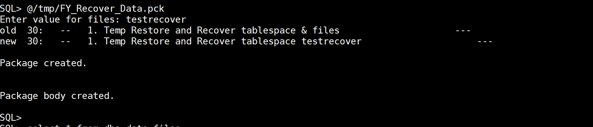
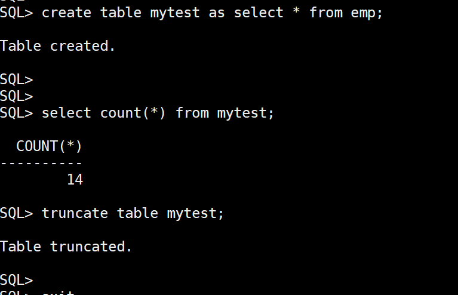
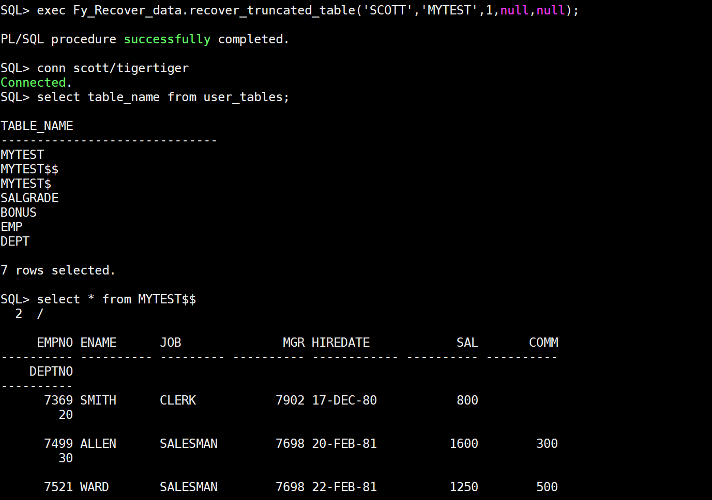

恢复truncate的表的数据


下载工具：http://www.hellodba.com/Download/FY_Recover_Data.zip

安装工具
```
SQL> @/home/oracle/FY_Recover_Data.pck
```



测试一把:



恢复:

>建议把输出和时间都打开
  ```
  set time on;
  set timing on;
  set serveroutput on;
  ```

执行恢复
```
SQL> exec Fy_Recover_data.recover_truncated_table('SCOTT','MYTEST',1,null,null);
```




> 表truncate后不能再写新数据，否则恢复的都是新的数据
