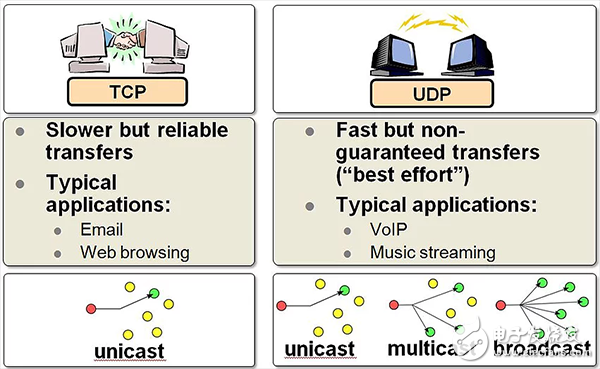
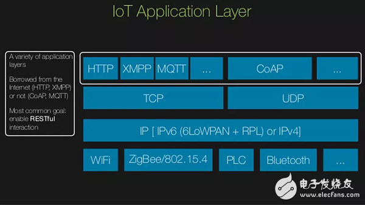
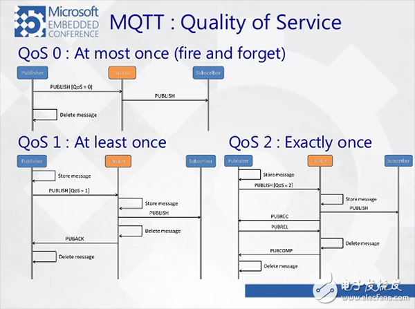
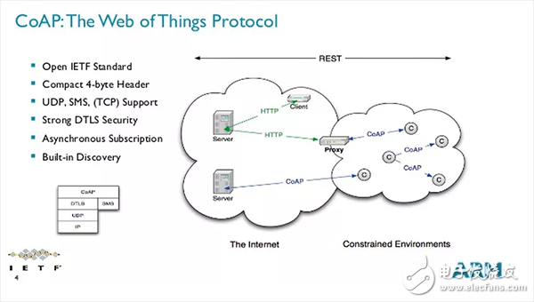

http://www.elecfans.com/news/wangluo/20171116580406.html

# TCP/IP、UDP、HTTP、MQTT、CoAP 五种协议概述

## 通信协议
通信协议可以被认为是一种语言，即两台或两台以上的设备可以相互交流。同时无规矩不成方圆，通信协议也遵循一组规则，两台设备会将有意义的信息传递给对方。在分布式系统中通信协议极为重要，相同的协议不同的部分在多个位置独立运行。系统在运行进程时可能是多样化的，因此在系统中需要保证一组通用的指令来通信。

IoT 之所以可以掀起热潮，信息物理融合系统（Cyber-Physical Systems，简称CPS）功不可没。物理设备连接到互联网和传递数据及接收数据的概念基于 IoT 解决方案的真正地实现。与此同时，这也增加了现有的通信协议及互联网的复杂性。

IoT 的发展历程中带来了很多可能性，但其中唯一可行的是机器与机器（M2M）通过互联网实现实时有效连接。一台设备被连接到互联网仅被认为是人际互动间的产物，而不是一个顺其自然的结果。因此，协议与互联网之间的通信总是在不可靠与缓慢的基础上发展。

## TCP/IP协议

除了通信协议，互联网协议体系结构的另一个方面是 TCP / IP 堆栈。它控制两台计算机之间的数据传输。其中采用三次握手建立一个连接，其中涉及客户端确认数据的接收且发送确认消息给服务器。第二次握手是服务器端接收到客户端的数据后，返回确认回单，第三次是客户端也返回一个确认回单给服务器端，从而关闭通信通道。

这种通信方法的优点具有可靠性，可共享所有被发送的数据，但因为其过程都需要验证，所以消耗时间比较久。

## UDP 协议
用户数据报协议（User Datagram Protocol，简称UDP）是一种比较快的通信方式，因为减少了确认程序。它是面向非连接的协议，它不与对方建立连接，而是直接就把数据包发送过去。因此，与 TCP/IP 相比，UDP 的可靠性相对不高，但是比较快。对于M2M 项目的快速原型，一个非常简单的解决方案是使用 UDP，因为就 UDP 头包含很少的字节，比 TCP 负载消耗少。

## HTTP 协议

在IoT 开发中协议最大的不同是在 OSI 模型的应用程序层。这一层在通信网络中指定了接口方法。系统如何连接服务器且数据如何发送都由这一层来决定。

其实最受欢迎的通信协议莫过于超文本传输协议（Hyper Text Transfer Protocol，简称HTTP）。主要应用于 web 浏览器。它运行在一个客户/服务器模型上，服务器响应任何的客户端需求。因 web 网页可能会加载很多内容，因此该协议有必要建立在 TCP/IP 堆栈之上。

## MQTT 协议

MQ 遥测传输（MQ Telemetry Transport，简称MQTT）是一个面向 IoT 应用程序的轻量级连接协议。它基于 TCP/IP 网络连接使用发布/订阅方法来传输数据。设计思想是开放、简单、轻量、易于实现，这也使它成为 IoT 开发的理想平台。

MQTT 很多有用的功能适用面向 IoT 应用程序。简而言之，想象一个公告板，无论什么时候，你都可以在上面记录或招贴。同时，对你所记录的内容感兴趣的任何人都可以看到。

MQTT 差不多就是这样的功能。

MQTT 包括代理和客户端两个部分。客户端可以访问或修改设备的数据，代理是持有并传递数据。

MQTT 使用发布/订阅消息模式。客户端可以在一个话题（Topic）下面发布特定参数数据给代理。另一个对此话题感兴趣的客户可以订阅该话题，并定期收到更新的消息。

MQTT 提供一个有质量的服务，从 IoT 角度来看，其本质是消息的优先级。在任何情况下一个重要的消息可以传输到目的地，因此有了服务质量（QoS），虽然传输速度会变慢但是交付有了保证。一个动态的数据源速度优先于效率，然而分配一个较低的 QoS，更像是一个“fire-and-forget”事件，如 UDP。

在一个主题下，MQTT 可以保留最后一个已收到的消息，前提是它发送给订阅者订阅链已启动。这允许订阅者在一个存在的客户端和代理网络中异步连接。这也为检查冗余及数据丢失提供了一个工具。

MQTT 客户端有一个属性称之为 Last Will a和 Testament。该属性允许客户端在异常中断的情况下发送通知给代理。这个快速的反馈有利于无线传感器网络自动再生，同时检测并修复缺失节点和异常值，最终确保无线传感器网络中数据流完美循环。

## CoAP 协议

CoAP 是一个基于 REST 模型的网络传输协议。主要用于轻量级 M2M 通信。由于物联网中的很多设备都是资源受限型的，即只有少量的内存空间和有限的计算能力，所以传统的 HTTP 协议应用在物联网上就显得过于庞大而不适用，CoAP 应运而生。

就用户可见性而言，CoAP 模拟了 HTTP 协议，并从这个角度来看，读数传感器数据本质上是像做一个 HTTP 请求。

CoAP 被认为是一种不会过时的技术协议，根据 Grtner 预测，500 亿台设备将会连接到互联网，未来进一步发展将迫切需要低成本、低能耗的设备。CoAP协议被设计用于与 10 kb RAM 一样的系统。

CoAP 更有趣的功能之一是能够发现网络中的节点。这对于低功耗无线传感器网络的自治和自我修复设计非常有用。关于无线传感器网络的可扩展性问题，可以使用 CoAP 协议来发现节点常规的冗余。

CoAP 是建立在 UDP 栈上，这是与 HTTP 或 MQTT 相比最主要的区别。它可以更加快速和更好的资源优化，而非资源密集型。

然而，在 CoAP 协议下 QoS 因素保持不变情况下，CoAP 相比 HTTP/MQTT 更加不可靠。但是 4 字节的头文件对于连续流系统如环境监测传感器网络是一个不错的选择。
