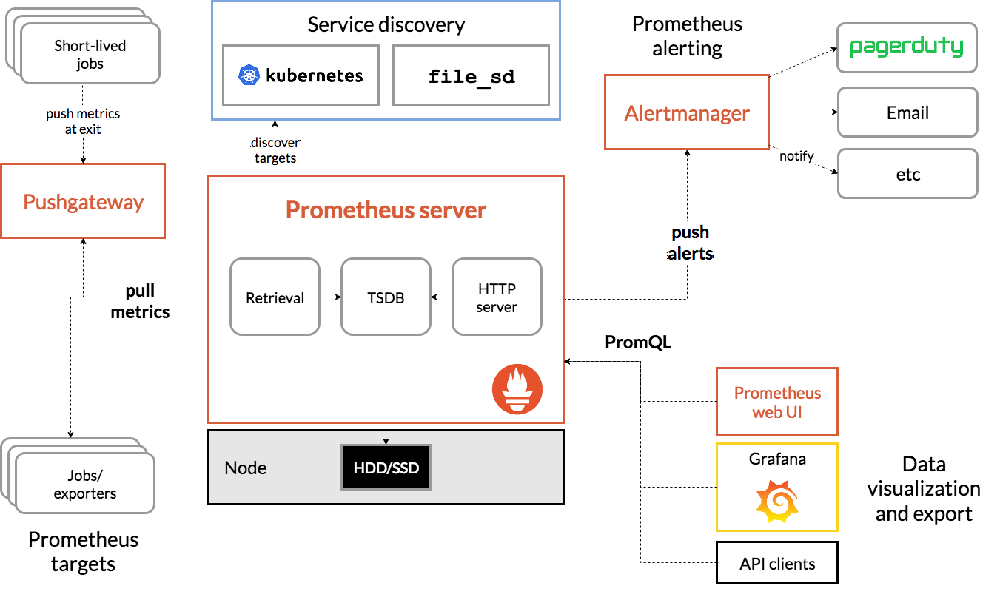

# 1.云数据库
## 产品:
- 关系型数据库: MySQL/PostgreSQL (单机/高可用)
- 文档数据库: mongodb
- 时序数据库: influxdb
- 缓存数据库: redis/memcache (标准/集群版/读写分离)
- 分布式数据库:hbase  (底层涉及到hdfs等)
- 数据仓库:greenplum

## 数据库服务:
- 常规运维
  - 高可用管理
  - 备份恢复
  - 日志管理
  - 监控报警
  - 扩容
- 数据管理
  - 数据压缩
  - 数据加密
  - 数据库监控
  - 数据迁移
      - 全量迁移
      - 增量迁移
  - 数据同步(灾备复制)
  - 数据订阅
  - 变更管理
  - 开发支持
- 安全风控
  - 网络安全
  - 存储安全
  - 操作审计
  - SQL审计
  - 安全访问
- 优化服务
  - 参数管理
  - 负载评估
  - 架构建议
  - SQL优化

## 实现方案
- PaaS
- Iaas

# 2.监控中心

## 部署方式
- 二进制
- 容器: 可完美融合kubernetes(CCS已经在用)

## 提供的功能
- pull
- push
- alertmanager
- tsdb + grafana

## 监控粒度:
- 主机
- k8s集群
- 工作负载
- 容器
- 其他exporter

# 3.容器云平台
## 技术paas产品
- 基础无状态类型组件
- GPU调度
- 机器学习(kubeflow)
- 数据库/消息/缓存
- serverless kubernetes
- 自建 kubernetes
- 镜像管理: 镜像安全扫描
- 应用管理(helm)
- 应用日志采集
- 容器应用配置管理
- 监控告警服务
- devops
- service mesh(istio)
- 访问方式: SLB/ingress/nodeport/内部访问/
- headless接入外部应用
- 在线web console
- 存储插件支持
- 健康检查/钩子
- 函数服务(faas) - 与IOT有关联

## 业务pass产品
- 应用商城(helm)/应用发布
- 资源管理
- 多租户
- 弹性伸缩
- 蓝绿/灰度/金丝雀 发布
- 报警通知
- 日志管理
- 版本(管理)上下线

## 服务提供
### 系统高可用:
- 环境隔离
- 限流降级
- 容量规划

### 应用管控:
- 微服务治理
- 系统高可用
- 服务扩容

### 数据化运营:
- 应用拓扑
- 基础监控
- 服务监控
- 链路分析
- 实时拓扑

## 依赖于IAAS的部分
VCS/裸金属/SLB/云存储/专用虚拟网络

# 4.云缓存
- 缓存:(可以融入到数据库的缓存数据库)
- 分布式缓存:Redis/Memcached

# 5.云消息
- 分布式消息服务 Kafka
- 分布式消息队列 RabbitMQ
