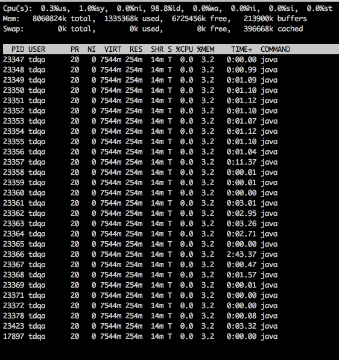

https://www.cnblogs.com/shengulong/p/8513652.html

top -Hp pid可以查看某个进程的线程信息

-H 显示线程信息，-p指定pid

jstack 线程ID 可以查看某个线程的堆栈情况，特别对于hung挂死的线程，可以使用选项-F强制打印dump信息jstack -F pid

　　jstack定义： jstack是java虚拟机自带的一种堆栈跟踪工具。用于生成java虚拟机当前时刻的线程快照。线程快照是当前java虚拟机内每一条线程正在执行的方法堆栈的集合，生成线程快照的主要目的是定位线程出现长时间停顿的原因，如线程间死锁、死循环、请求外部资源导致的长时间等待等。

　　PS : 在实际运行中，往往一次 dump的信息，还不足以确认问题。建议产生三次 dump信息，如果每次 dump都指向同一个问题，我们才确定问题的典型性。也就是多进行几次线程快照，观察变化，查看问题所在。
